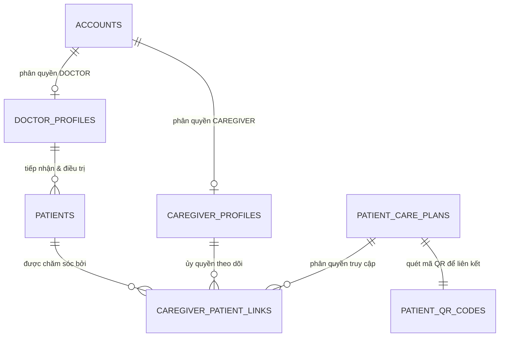
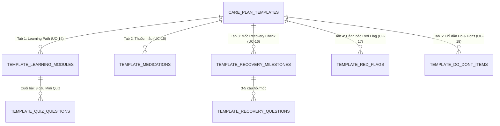
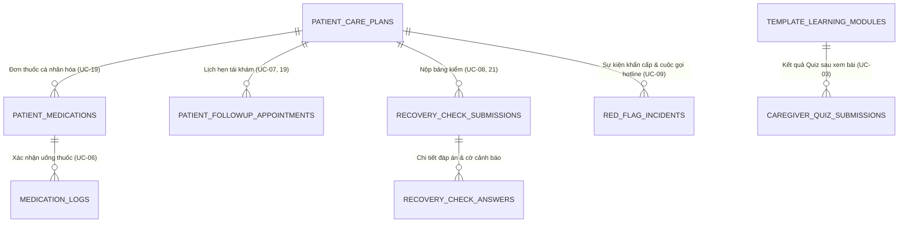

# 02. Sơ Đồ Thực Thể Quan Hệ (Entity Relationship Diagram - ERD)

> **Dự án:** Hệ Thống Hướng Dẫn & Theo Dõi Chăm Sóc Bệnh Nhân Hậu Phẫu Mắt (Post-Op Eye Care Platform)  
> **Tài liệu tham chiếu:** [file_use_case_spec.md](file:///d:/DOC_BA/docs_of_projects/file_use_case_spec.md) | [01_Database_Analysis.md](file:///d:/DOC_BA/docs_of_projects/01_Database_Analysis.md)  
> **Người thực hiện:** Đội ngũ BA  
> **Ngày lập:** 11/09/2026 | **Trạng thái:** Bản chuẩn hóa thiết kế (Baseline)

---

## 1. Tổng Quan Kiến Trúc Dữ Liệu

Mô hình ERD được xây dựng nhằm chuẩn hóa dữ liệu cho hai phân hệ chính (**Bác sĩ** và **Người chăm sóc**), đồng thời đáp ứng trọn vẹn các yêu cầu:
1. **Phân tách rạch ròi 2 lớp dữ liệu:**
   * **Lớp Mẫu chuẩn (Master Template Layer):** Đóng gói quy trình chăm sóc chuyên khoa chuẩn gồm 5 thành phần con (*Learning Path, Thuốc mẫu, Recovery Check, Red Flag, Do & Don't*) do Bác sĩ biên soạn và tinh chỉnh.
   * **Lớp Thực thi Bệnh nhân (Patient Instance Layer):** Các bản ghi kế hoạch chăm sóc riêng biệt được nhân bản cho từng bệnh nhân để đảm bảo tính độc lập lâm sàng (BR18).
2. **Theo dõi giao dịch & Giám sát an toàn y tế:** Lưu vết các sự kiện chăm sóc hàng ngày (uống thuốc, làm bài kiểm tra quiz, nộp bảng kiểm phục hồi, kích hoạt cảnh báo khẩn cấp).
3. **Mở rộng cho Admin `[FUTURE / ADMIN]`:** Tích hợp bảng tài khoản chung và nhật ký kiểm toán (*Audit Trail*) sẵn sàng cho CRUD Account và CRUD Audit Log.

---

## 2. Sơ Đồ ERD Tổng Thể Hệ Thống (Master ERD)

```mermaid
erDiagram
    %% ========================================================
    %% 1. PHÂN HỆ TÀI KHOẢN & ĐỊNH DANH
    %% ========================================================
    ACCOUNTS ||--o| DOCTOR_PROFILES : "extends"
    ACCOUNTS ||--o| CAREGIVER_PROFILES : "extends"
    ACCOUNTS ||--o{ AUDIT_LOGS : "logs_activity [FUTURE / ADMIN]"
    ACCOUNTS ||--o{ OTP_VERIFICATIONS : "authenticates_via"

    %% ========================================================
    %% 2. PHÂN HỆ HỒ SƠ BỆNH NHÂN & LIÊN KẾT ỦY QUYỀN
    %% ========================================================
    DOCTOR_PROFILES ||--o{ PATIENTS : "creates_and_manages"
    PATIENTS ||--o{ PATIENT_CARE_PLANS : "has_care_episodes"
    PATIENTS ||--o{ CAREGIVER_PATIENT_LINKS : "linked_with"
    CAREGIVER_PROFILES ||--o{ CAREGIVER_PATIENT_LINKS : "authorized_to_care"

    %% ========================================================
    %% 3. PHÂN HỆ MASTER CARE PLAN TEMPLATE
    %% ========================================================
    DOCTOR_PROFILES ||--o{ CARE_PLAN_TEMPLATES : "authors"
    DOCTOR_PROFILES ||--o{ PATIENT_FOLLOWUP_APPOINTMENTS : "examines"
    DOCTOR_PROFILES ||--o{ PATIENT_QR_CODES : "issues"
    DOCTOR_PROFILES ||--o{ RED_FLAG_INCIDENTS : "handles"
    CARE_PLAN_TEMPLATES ||--o{ TEMPLATE_LEARNING_MODULES : "contains_modules"
    TEMPLATE_LEARNING_MODULES ||--o{ TEMPLATE_QUIZ_QUESTIONS : "has_3_quiz_questions"
    CARE_PLAN_TEMPLATES ||--o{ TEMPLATE_MEDICATIONS : "configures_medications"
    CARE_PLAN_TEMPLATES ||--o{ TEMPLATE_RECOVERY_MILESTONES : "defines_milestones"
    TEMPLATE_RECOVERY_MILESTONES ||--o{ TEMPLATE_RECOVERY_QUESTIONS : "has_3_to_5_questions"
    CARE_PLAN_TEMPLATES ||--o{ TEMPLATE_RED_FLAGS : "configures_red_flags"
    CARE_PLAN_TEMPLATES ||--o{ TEMPLATE_DO_DONT_ITEMS : "configures_guidelines"

    %% ========================================================
    %% 4. PHÂN HỆ KẾ HOẠCH BỆNH NHÂN (PATIENT CARE PLAN INSTANCE)
    %% ========================================================
    CARE_PLAN_TEMPLATES ||--o{ PATIENT_CARE_PLANS : "instantiated_into"
    PATIENT_CARE_PLANS ||--|| PATIENT_QR_CODES : "secured_by_token"
    PATIENT_CARE_PLANS ||--o{ PATIENT_MEDICATIONS : "prescribes"
    PATIENT_CARE_PLANS ||--o{ PATIENT_FOLLOWUP_APPOINTMENTS : "schedules"
    PATIENT_CARE_PLANS ||--o{ CAREGIVER_PATIENT_LINKS : "grants_access_to"

    %% ========================================================
    %% 5. PHÂN HỆ GIAO DỊCH & SỰ KIỆN LÂM SÀNG
    %% ========================================================
    PATIENT_MEDICATIONS ||--o{ MEDICATION_LOGS : "confirmed_intake"
    CAREGIVER_PROFILES ||--o{ MEDICATION_LOGS : "recorded_by"
    
    TEMPLATE_LEARNING_MODULES ||--o{ CAREGIVER_QUIZ_SUBMISSIONS : "assesses"
    CAREGIVER_PROFILES ||--o{ CAREGIVER_QUIZ_SUBMISSIONS : "completed_by"

    PATIENT_CARE_PLANS ||--o{ RECOVERY_CHECK_SUBMISSIONS : "receives_evaluations"
    TEMPLATE_RECOVERY_MILESTONES ||--o{ RECOVERY_CHECK_SUBMISSIONS : "evaluated_at_milestone"
    CAREGIVER_PROFILES ||--o{ RECOVERY_CHECK_SUBMISSIONS : "submitted_by"
    RECOVERY_CHECK_SUBMISSIONS ||--o{ RECOVERY_CHECK_ANSWERS : "contains_answers"
    TEMPLATE_RECOVERY_QUESTIONS ||--o{ RECOVERY_CHECK_ANSWERS : "answers_for"

    PATIENT_CARE_PLANS ||--o{ RED_FLAG_INCIDENTS : "triggers_emergency"
    TEMPLATE_RED_FLAGS ||--o{ RED_FLAG_INCIDENTS : "matches_sign"
    CAREGIVER_PROFILES ||--o{ RED_FLAG_INCIDENTS : "reported_by"
    DOCTOR_PROFILES ||--o{ RED_FLAG_INCIDENTS : "handled_by"

    %% ========================================================
    %% THỰC THỂ CHI TIẾT
    %% ========================================================
    OTP_VERIFICATIONS {
        uuid otp_id PK
        string phone_number
        string otp_code
        timestamp expired_at
        boolean is_used
        int attempt_count
        timestamp created_at
    }

    ACCOUNTS {
        uuid account_id PK
        string phone_number UK
        string username UK
        string email UK
        string password_hash
        string role "CAREGIVER | DOCTOR | ADMIN"
        string status "ACTIVE | LOCKED | INACTIVE"
        timestamp created_at
        timestamp updated_at
    }

    DOCTOR_PROFILES {
        uuid doctor_id PK, FK
        string full_name
        string license_number UK
        string department
        string hospital_name
        string phone_number
    }

    CAREGIVER_PROFILES {
        uuid caregiver_id PK, FK
        string full_name
        string relationship_with_patient
    }

    PATIENTS {
        string patient_id PK
        string full_name
        date date_of_birth
        string gender
        string phone_number
        string surgery_type
        date surgery_date
        string operated_eye "LEFT | RIGHT | BOTH"
        jsonb clinical_custom_data "Dynamic fields per surgery"
        string status "ACTIVE | ARCHIVED"
        uuid created_by_doctor_id FK
        timestamp created_at
    }

    CAREGIVER_PATIENT_LINKS {
        uuid link_id PK
        uuid caregiver_id FK
        string patient_id FK
        uuid care_plan_id FK
        timestamp linked_at
        string status "ACTIVE | REVOKED"
    }

    CARE_PLAN_TEMPLATES {
        uuid template_id PK
        string template_name
        string surgery_type
        string clinical_description
        string status "DRAFT | ACTIVE | INACTIVE"
        uuid created_by_doctor_id FK
        timestamp created_at
        timestamp updated_at
    }

    TEMPLATE_LEARNING_MODULES {
        uuid module_id PK
        uuid template_id FK
        string title
        string category
        text content_text
        string media_type "VIDEO | IMAGE | INFOGRAPHIC | TEXT"
        string media_url
        int display_order
    }

    TEMPLATE_QUIZ_QUESTIONS {
        uuid question_id PK
        uuid module_id FK
        text question_text
        text option_a
        text option_b
        text option_c
        text option_d
        string correct_option "A | B | C | D"
        text clinical_explanation
        int display_order
    }

    TEMPLATE_MEDICATIONS {
        uuid medication_template_id PK
        uuid template_id FK
        string surgery_type
        string drug_name
        string drug_form "EYE_DROP | ORAL"
        string dosage
        string frequency
        jsonb times_of_day
        string meal_relation
        int duration_days
        int order_index
        text visual_identification
        text clinical_cautions
    }

    TEMPLATE_RECOVERY_MILESTONES {
        uuid milestone_template_id PK
        uuid template_id FK
        string surgery_type
        string milestone_name
        int days_post_op
    }

    TEMPLATE_RECOVERY_QUESTIONS {
        uuid question_template_id PK
        uuid milestone_template_id FK
        text question_text
        string answer_type
        jsonb options_json
        string normal_criteria
        string attention_criteria
        string red_flag_criteria
        int order_index
    }

    TEMPLATE_RED_FLAGS {
        uuid red_flag_template_id PK
        uuid template_id FK
        string surgery_type
        string sign_name
        string warning_level "EMERGENCY | SAME_DAY_EXAM"
        text first_aid_instructions
        string emergency_hotline
        int order_index
    }

    TEMPLATE_DO_DONT_ITEMS {
        uuid do_dont_template_id PK
        uuid template_id FK
        string surgery_type
        string item_type "DO | DONT"
        string category "HYGIENE | ACTIVITY | DIET | SLEEP"
        string behavior_title
        text clinical_explanation
        string applicable_duration
        int order_index
    }

    PATIENT_CARE_PLANS {
        uuid care_plan_id PK
        string patient_id FK
        uuid source_template_id FK
        string surgery_type
        string status "DRAFT | ACTIVE | COMPLETED | ARCHIVED"
        timestamp activated_at
        uuid created_by_doctor_id FK
    }

    PATIENT_QR_CODES {
        uuid qr_id PK
        uuid care_plan_id FK, UK
        string qr_token UK
        uuid issued_by_doctor_id FK
        timestamp issued_at
        string status "ACTIVE | REVOKED"
        int print_count
    }

    PATIENT_MEDICATIONS {
        uuid patient_medication_id PK
        uuid care_plan_id FK
        string drug_name
        string drug_form
        string dosage
        string frequency
        jsonb times_of_day
        int duration_days
        int order_index
        text visual_identification
        text clinical_cautions
        date start_date
    }

    PATIENT_FOLLOWUP_APPOINTMENTS {
        uuid appointment_id PK
        uuid care_plan_id FK
        date appointment_date
        time appointment_time
        uuid doctor_id FK
        string clinic_location
        boolean reminder_24h_sent
        boolean reminder_2h_sent
        string status
    }

    MEDICATION_LOGS {
        uuid log_id PK
        uuid patient_medication_id FK
        uuid caregiver_id FK
        timestamp scheduled_time
        timestamp confirmed_at
        string status "TAKEN | SKIPPED"
    }

    CAREGIVER_QUIZ_SUBMISSIONS {
        uuid submission_id PK
        uuid caregiver_id FK
        uuid module_id FK
        int correct_answers_count
        int total_questions
        jsonb answers_detail
        timestamp submitted_at
    }

    RECOVERY_CHECK_SUBMISSIONS {
        uuid submission_id PK
        uuid care_plan_id FK
        uuid milestone_template_id FK
        uuid caregiver_id FK
        timestamp submitted_at
        string overall_status "NORMAL | NEEDS_ATTENTION | RED_FLAG"
        boolean doctor_viewed
        timestamp doctor_viewed_at
    }

    RECOVERY_CHECK_ANSWERS {
        uuid answer_id PK
        uuid submission_id FK
        uuid question_template_id FK
        string answer_value
        string flag_level "NORMAL | NEEDS_ATTENTION | RED_FLAG"
    }

    RED_FLAG_INCIDENTS {
        uuid incident_id PK
        uuid care_plan_id FK
        uuid caregiver_id FK
        string trigger_source "RECOVERY_CHECK | MANUAL_BUTTON"
        uuid red_flag_template_id FK
        timestamp triggered_at
        boolean call_initiated
        uuid acknowledged_by_doctor_id FK
        text clinical_resolution
    }

    AUDIT_LOGS {
        bigint audit_id PK
        uuid user_id FK
        string action_type
        string target_entity
        string target_id
        jsonb old_data
        jsonb new_data
        timestamp timestamp
    }
```

---

## 3. Phân Rã Sơ Đồ Theo Từng Phân Hệ Chức Năng

### 3.1 Phân Hệ 1: Quản Lý Người Dùng & Ủy Quyền Liên Kết (Auth & Caregiver-Patient Links)

* **Ý nghĩa:** Giải quyết trọn vẹn luồng [UC-01 (Đăng nhập Caregiver)](file:///d:/DOC_BA/docs_of_projects/file_use_case_spec.md#L11-L49), [UC-02 (Quét mã QR liên kết)](file:///d:/DOC_BA/docs_of_projects/file_use_case_spec.md#L51-L84) và [UC-11 (Đăng nhập Bác sĩ)](file:///d:/DOC_BA/docs_of_projects/file_use_case_spec.md#L287-L319).
* Caregiver không cần tài khoản tạo trước, đăng nhập OTP tạo bản ghi trong `accounts` và `caregiver_profiles`. Khi quét QR của bệnh nhân, bảng `caregiver_patient_links` thiết lập quan hệ ràng buộc an toàn (BR5).

---

### 3.2 Phân Hệ 2: Cấu Hình Master Care Plan Template (Nhóm UC-13 đến UC-18)

* **Ý nghĩa:** Hỗ trợ không gian cấu hình 5 tab thành phần con trong [UC-13.1](file:///d:/DOC_BA/docs_of_projects/file_use_case_spec.md#L465-L489) và [UC-13.4](file:///d:/DOC_BA/docs_of_projects/file_use_case_spec.md#L536-L561).
* Mọi cấu phần đều gắn liền với `template_id` và lưu trường `surgery_type` áp dụng theo đúng yêu cầu vừa chuẩn hóa.

---

### 3.3 Phân Hệ 3: Thể Hiện Kế Hoạch Bệnh Nhân & Giao Dịch Lâm Sàng (Instance & Execution)

* **Ý nghĩa:**
  * Thể hiện tính nguyên khối và cô lập của dữ liệu bệnh nhân (BR17, BR18). Khi bác sĩ nhân bản từ template sang cho bệnh nhân (UC-19), đơn thuốc thực tế được ghi vào `patient_medications` độc lập.
  * Mọi hành động của Caregiver nộp bảng kiểm, xác nhận uống thuốc hay gọi cấp cứu đều sinh bản ghi giao dịch có dấu thời gian chính xác.

---

## 4. Bảng Tổng Hợp Khóa Ngoại & Hành Vi Xóa Dữ Liệu (Foreign Key & On Delete Actions)

| Khóa Ngoại (Foreign Key) | Bảng Nguồn | Bảng Đích Tham Chiếu | Hành Vi ON DELETE | Lý Do Nghiệp Vụ Y Khoa |
|---|---|---|:---:|---|
| `created_by_doctor_id` | `patients` | `doctor_profiles(doctor_id)` | **RESTRICT** | Không được xóa bác sĩ nếu đang phụ trách hồ sơ bệnh nhân |
| `created_by_doctor_id` | `care_plan_templates` | `doctor_profiles(doctor_id)` | **RESTRICT** | Bảo toàn quyền tác giả và nguồn gốc y khoa (BR7) |
| `template_id` | `template_learning_modules` | `care_plan_templates(template_id)` | **CASCADE** | Xóa template thì xóa toàn bộ bài học cấu phần |
| `module_id` | `template_quiz_questions` | `template_learning_modules(module_id)` | **CASCADE** | Xóa bài học thì xóa 3 câu hỏi trắc nghiệm tương ứng |
| `template_id` | `template_medications` | `care_plan_templates(template_id)` | **CASCADE** | Xóa template thì xóa danh mục thuốc mẫu đi kèm |
| `template_id` | `template_recovery_milestones` | `care_plan_templates(template_id)` | **CASCADE** | Xóa template thì xóa các mốc khảo sát |
| `milestone_template_id` | `template_recovery_questions`| `template_recovery_milestones(...)` | **CASCADE** | Xóa mốc khảo sát thì xóa các câu hỏi thuộc mốc |
| `template_id` | `template_red_flags` | `care_plan_templates(template_id)` | **CASCADE** | Xóa template thì xóa danh mục cảnh báo Red Flag |
| `template_id` | `template_do_dont_items` | `care_plan_templates(template_id)` | **CASCADE** | Xóa template thì xóa các chỉ dẫn Do & Don't |
| `patient_id` | `patient_care_plans` | `patients(patient_id)` | **RESTRICT** | Không được xóa bệnh nhân nếu đang có Care Plan (BR25) |
| `source_template_id` | `patient_care_plans` | `care_plan_templates(template_id)` | **RESTRICT** | Không thể xóa template nếu đã có bệnh nhân đang áp dụng |
| `care_plan_id` | `patient_qr_codes` | `patient_care_plans(care_plan_id)` | **CASCADE** | Mã QR luôn gắn liền với vòng đời Care Plan |
| `care_plan_id` | `patient_medications` | `patient_care_plans(care_plan_id)` | **CASCADE** | Xóa Care Plan nháp thì xóa danh mục thuốc gắn với nó |
| `care_plan_id` | `patient_followup_appointments`| `patient_care_plans(care_plan_id)` | **CASCADE** | Xóa Care Plan nháp thì xóa lịch hẹn đi kèm |
| `care_plan_id` | `recovery_check_submissions` | `patient_care_plans(care_plan_id)` | **RESTRICT** | Không cho phép xóa kế hoạch nếu đã phát sinh dữ liệu lâm sàng |
| `care_plan_id` | `red_flag_incidents` | `patient_care_plans(care_plan_id)` | **RESTRICT** | Dữ liệu sự cố khẩn cấp bắt buộc phải lưu trữ phục vụ pháp lý y tế |
