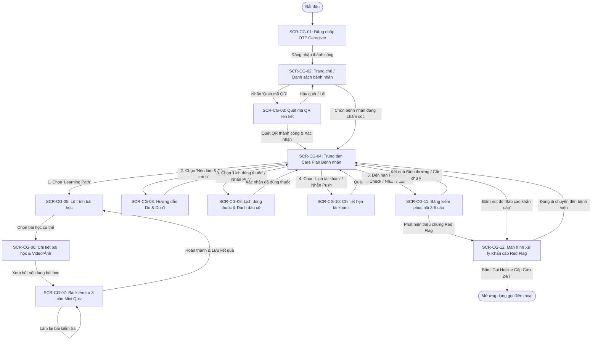
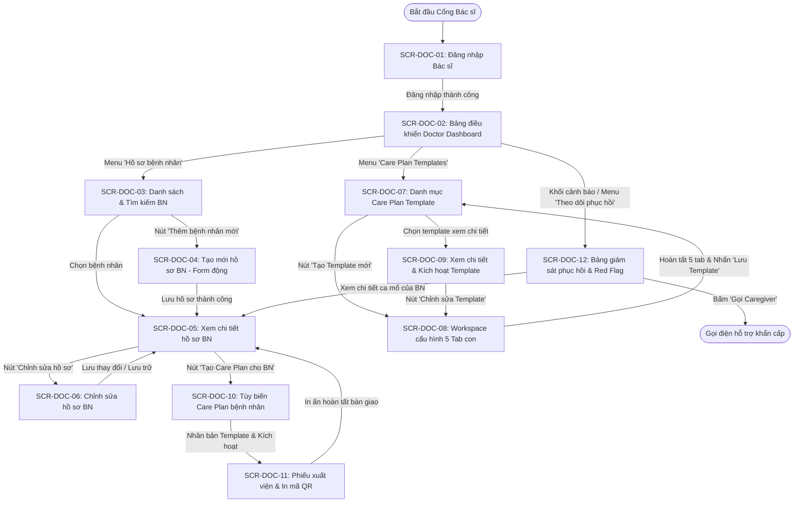
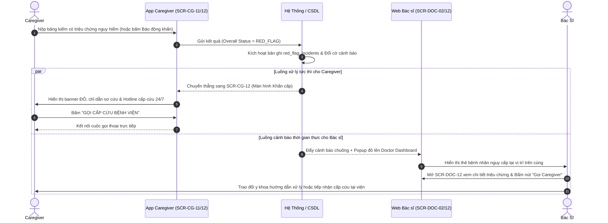

# 04. Luồng Chuyển Động Màn Hình (Screen Flow Specification)

> **Dự án:** Hệ Thống Hướng Dẫn & Theo Dõi Chăm Sóc Bệnh Nhân Hậu Phẫu Mắt (Post-Op Eye Care Platform)  
> **Tài liệu tham chiếu:** [file_use_case_spec.md](file:///d:/DOC_BA/docs_of_projects/file_use_case_spec.md) | [01_Database_Analysis.md](file:///d:/DOC_BA/docs_of_projects/01_Database_Analysis.md)  
> **Người thực hiện:** Đội ngũ BA  
> **Ngày lập:** 11/09/2026 | **Trạng thái:** Bản chuẩn hóa thiết kế (Baseline)

---

## 1. Tổng Quan & Phạm Vi Luồng Màn Hình

Tài liệu này xác lập danh mục màn hình giao diện người dùng và thiết kế luồng tương tác (Screen Flow) phản ánh 100% các bước trong **Luồng chính (Main Flow)**, **Luồng thay thế (Alternative Flow)** và **Luồng ngoại lệ (Exception Flow)** của tài liệu Use Case Specification.

### Ranh giới phạm vi hệ thống:
* **Phân hệ Người chăm sóc (Caregiver):** Ứng dụng di động (Mobile App / Responsive Web) tối ưu cho thao tác một tay, giao diện chữ to, trực quan cao cho người lớn tuổi.
* **Phân hệ Bác sĩ (Doctor):** Cổng thông tin web (Web Portal) chuyên môn trên máy tính / máy tính bảng phục vụ tiếp nhận hồ sơ bệnh án, cấu hình phác đồ mẫu và giám sát phục hồi.
* **Lưu ý Quản trị viên `[FUTURE / ADMIN]`:** Theo ranh giới phạm vi, tài liệu không thiết kế màn hình chi tiết cho Admin; luồng màn hình chỉ tập trung vào 2 tác nhân hiện hữu là **Caregiver** và **Doctor**.

---

## 2. Danh Mục & Đặc Tả Màn Hình Chi Tiết (Screen Inventory)

---

### PHÂN HỆ 1: NGƯỜI CHĂM SÓC (CAREGIVER SCREENS)

#### 1. `SCR-CG-01`: Đăng nhập OTP Caregiver (Caregiver Login)
* **Tác nhân:** Người chăm sóc (Caregiver).
* **Điểm vào (Entry Point):** Khởi chạy ứng dụng hoặc quét mã QR khi chưa đăng nhập (UC-01 A1).
* **Hành động chính (Main Actions):** Nhập số điện thoại → Bấm "Tiếp tục" → Nhập mã OTP 6 chữ số → Bấm "Đăng nhập".
* **Màn hình trước / tiếp theo:**
  * *Previous Screen:* Không có (màn hình khởi đầu).
  * *Next Screen:* `SCR-CG-02` (Trang chủ) hoặc `SCR-CG-04` (Mở thẳng Care Plan nếu đến từ luồng quét QR).
* **Trạng thái thành công (Success State):** Xác thực OTP thành công, thiết lập phiên làm việc và chuyển trang.
* **Trạng thái lỗi / ngoại lệ (Error State):**
  * SĐT sai định dạng (*E1: Thông báo viền đỏ*).
  * Mã OTP sai / hết hạn (*E3, E4: Thông báo lỗi, hiển thị nút "Gửi lại mã"*).
  * Tài khoản bị khóa (*E5: Cảnh báo tài khoản bị vô hiệu hóa*).

---

#### 2. `SCR-CG-02`: Trang chủ & Danh sách bệnh nhân (Caregiver Dashboard)
* **Tác nhân:** Caregiver.
* **Điểm vào:** Sau khi đăng nhập thành công từ `SCR-CG-01`.
* **Hành động chính:**
  * Xem danh sách các bệnh nhân đang chăm sóc kèm trạng thái phục hồi.
  * Nhấn nút "Quét mã QR bệnh nhân mới" (`SCR-CG-03`).
  * Nhấn chọn một bệnh nhân để vào Trung tâm Care Plan (`SCR-CG-04`).
  * Nhấn "Đăng xuất" tài khoản.
* **Màn hình trước / tiếp theo:**
  * *Previous Screen:* Đăng nhập.
  * *Next Screen:* `SCR-CG-03` (Quét QR), `SCR-CG-04` (Chi tiết Care Plan bệnh nhân).
* **Trạng thái thành công:** Hiển thị thẻ bệnh nhân, tiến độ phục hồi và banner nhắc việc trong ngày.
* **Trạng thái lỗi / ngoại lệ:** Chưa liên kết bệnh nhân nào (*Hiển thị màn hình trống kèm nút bấm lớn gợi ý Quét mã QR*).

---

#### 3. `SCR-CG-03`: Quét mã QR liên kết bệnh nhân (QR Scanner)
* **Tác nhân:** Caregiver.
* **Điểm vào:** Nhấn nút "Quét mã QR" từ `SCR-CG-02` hoặc banner trang chủ (UC-02).
* **Hành động chính:** Hướng camera vào mã QR trên phiếu xuất viện → Xem tóm tắt thông tin bệnh nhân (Tên, Năm sinh, Loại mổ, Bác sĩ) → Bấm "Xác nhận liên kết".
* **Màn hình trước / tiếp theo:**
  * *Previous Screen:* `SCR-CG-02` (khi bấm "Hủy bỏ" - A1).
  * *Next Screen:* `SCR-CG-04` (Trung tâm Care Plan của bệnh nhân vừa quét).
* **Trạng thái thành công:** Thông báo: "Liên kết hồ sơ bệnh nhân thành công" và mở thẳng kế hoạch chăm sóc.
* **Trạng thái lỗi / ngoại lệ:**
  * Không cấp quyền camera (*E1: Hiển thị hướng dẫn mở cài đặt thiết bị*).
  * Mã QR không hợp lệ / không thuộc hệ thống (*E2: Báo lỗi mã không hợp lệ*).
  * Kế hoạch chăm sóc gắn với QR đã kết thúc (*E3: Thông báo QR đã hết hạn/vô hiệu hóa*).

---

#### 4. `SCR-CG-04`: Trung tâm Kế Hoạch Chăm Sóc Bệnh Nhân (Patient Care Plan Hub)
* **Tác nhân:** Caregiver.
* **Điểm vào:** Chọn bệnh nhân từ `SCR-CG-02` hoặc ngay sau khi quét QR `SCR-CG-03`.
* **Hành động chính:**
  * Banner khẩn cấp Red Flag: Nút đỏ lớn "Báo cáo dấu hiệu bất thường / Cần hỗ trợ khẩn cấp" (`SCR-CG-12`).
  * Banner nhắc nhở Recovery Check đến hạn (`SCR-CG-11`).
  * 4 Thẻ điều hướng chức năng chính:
    1. **Learning Path & Mini Quiz** (`SCR-CG-05`).
    2. **Lịch dùng thuốc & Hướng dẫn nhỏ mắt** (`SCR-CG-09`).
    3. **Hướng dẫn Nên làm & Cần tránh (Do & Don't)** (`SCR-CG-08`).
    4. **Lịch hẹn tái khám & Nhắc hẹn** (`SCR-CG-10`).
* **Màn hình trước / tiếp theo:**
  * *Previous Screen:* `SCR-CG-02` (Trang chủ).
  * *Next Screen:* `SCR-CG-05`, `SCR-CG-08`, `SCR-CG-09`, `SCR-CG-10`, `SCR-CG-11`, `SCR-CG-12`.
* **Trạng thái thành công:** Hiển thị thông tin tổng hợp cập nhật theo thời gian thực.
* **Trạng thái lỗi / ngoại lệ:** Mất kết nối internet (*Hiển thị dữ liệu bộ nhớ đệm Offline Cache và thông báo*).

---

#### 5. `SCR-CG-05`: Lộ trình bài học Learning Path (Learning Path Phase List)
* **Tác nhân:** Caregiver (UC-03).
* **Điểm vào:** Chọn "Learning Path" từ `SCR-CG-04`.
* **Hành động chính:** Xem danh sách bài học chia theo giai đoạn (24h đầu, Tuần đầu, Vệ sinh mắt...) kèm trạng thái hoàn thành → Nhấn chọn bài học để xem (`SCR-CG-06`).
* **Màn hình trước / tiếp theo:**
  * *Previous Screen:* `SCR-CG-04`.
  * *Next Screen:* `SCR-CG-06` (Chi tiết bài học).
* **Trạng thái thành công:** Hiển thị thanh tiến độ đào tạo (% đã xem) và danh mục bài học trực quan.

---

#### 6. `SCR-CG-06`: Chi tiết bài học & Video/Ảnh hướng dẫn (Lesson Detail & Media)
* **Tác nhân:** Caregiver (UC-03).
* **Điểm vào:** Chọn bài học từ `SCR-CG-05`.
* **Hành động chính:** Xem video/hình ảnh minh họa thao tác chuẩn y khoa → Đọc văn bản hướng dẫn → Khi xem hết video/hình ảnh, màn hình tự động chuyển tiếp sang làm Mini Quiz (`SCR-CG-07`).
* **Màn hình trước / tiếp theo:**
  * *Previous Screen:* `SCR-CG-05`.
  * *Next Screen:* `SCR-CG-07` (Bộ câu hỏi Mini Quiz kiểm tra sau bài học).
* **Trạng thái thành công:** Trình phát media mượt mà, ghi nhận đã hoàn thành nội dung lý thuyết.
* **Trạng thái lỗi / ngoại lệ:** Lỗi tải video (*E1: Hiển thị văn bản hướng dẫn thay thế kèm nút "Thử tải lại"*).

---

#### 7. `SCR-CG-07`: Bài kiểm tra trắc nghiệm Mini Quiz & Kết quả (Mini Quiz & Results)
* **Tác nhân:** Caregiver (UC-03 Step 3, 4).
* **Điểm vào:** Tự động hiển thị ở cuối bài học từ `SCR-CG-06`.
* **Hành động chính:**
  * Trả lời 3 câu hỏi trắc nghiệm kiến thức.
  * Bấm "Nộp bài".
  * Xem kết quả: Số câu đúng, đáp án chính xác kèm giải thích y khoa.
  * Nhấn "Làm lại câu hỏi" (A1) HOẶC "Hoàn thành bài học" (quay về `SCR-CG-05`).
* **Màn hình trước / tiếp theo:**
  * *Previous Screen:* `SCR-CG-06`.
  * *Next Screen:* `SCR-CG-05` (Danh sách bài học).
* **Trạng thái thành công:** Chúc mừng hoàn thành bài học, tích xanh trạng thái, lưu điểm vào hệ thống (BR8).
* **Trạng thái lỗi / ngoại lệ:** Chưa chọn hết 3 câu (*E2: Chặn nộp bài, đánh dấu câu hỏi còn trống*).

---

#### 8. `SCR-CG-08`: Hướng dẫn Nên làm & Cần tránh (Do & Don't Guidelines)
* **Tác nhân:** Caregiver (UC-05).
* **Điểm vào:** Chọn mục "Nên làm & Cần tránh" từ `SCR-CG-04`.
* **Hành động chính:**
  * Xem giao diện 2 cột: Cột Xanh (Do - Việc nên làm) và Cột Đỏ (Don't - Việc cần tránh).
  * Lọc theo nhóm sinh hoạt: Vệ sinh, Vận động, Ăn uống, Giấc ngủ (A1).
  * Nhấn vào từng mục để xem giải thích y khoa và thời gian kiêng cữ.
* **Màn hình trước / tiếp theo:**
  * *Previous Screen:* `SCR-CG-04`.
* **Trạng thái thành công:** Phân định màu sắc trực quan (BR22).
* **Trạng thái lỗi / ngoại lệ:** Chưa có cấu hình (*E1: Thông báo phác đồ đang được Bác sĩ cập nhật*).

---

#### 9. `SCR-CG-09`: Lịch dùng thuốc & Xác nhận cữ (Medication Schedule & Confirmation)
* **Tác nhân:** Caregiver (UC-06).
* **Điểm vào:** Bấm vào thông báo nhắc thuốc hoặc chọn "Lịch dùng thuốc" từ `SCR-CG-04`.
* **Hành động chính:**
  * Xem danh sách thuốc theo cữ trong ngày (Sáng, Trưa, Chiều, Tối) kèm hình ảnh, mô tả nhận diện (màu vỏ, nắp lọ) và lưu ý sử dụng.
  * Xem bộ đếm lùi thời gian giãn cách 5 phút nếu có từ 2 loại thuốc nhỏ mắt trở lên (BR23).
  * Nhấn nút "Đánh dấu đã dùng thuốc".
* **Màn hình trước / tiếp theo:**
  * *Previous Screen:* `SCR-CG-04`.
* **Trạng thái thành công:** Đổi màu trạng thái sang xanh lá "Đã dùng", lưu mốc thời gian thực tế vào CSDL.

---

#### 10. `SCR-CG-10`: Chi tiết lịch hẹn tái khám (Follow-up Appointment Details)
* **Tác nhân:** Caregiver (UC-07).
* **Điểm vào:** Bấm vào thông báo nhắc hẹn hoặc chọn "Lịch tái khám" từ `SCR-CG-04`.
* **Hành động chính:** Xem chi tiết phiếu hẹn: Ngày khám, Giờ khám, Bác sĩ phụ trách, Địa điểm phòng khám, Giấy tờ và thuốc cần mang theo, Lưu ý trước khám.
* **Màn hình trước / tiếp theo:**
  * *Previous Screen:* `SCR-CG-04`.
* **Trạng thái thành công:** Hiển thị chi tiết buổi hẹn rõ ràng.

---

#### 11. `SCR-CG-11`: Bảng kiểm phục hồi định kỳ (Submit Recovery Check Survey)
* **Tác nhân:** Caregiver (UC-08).
* **Điểm vào:** Nhấn vào thông báo đẩy hoặc banner nhắc nhở đến mốc Recovery Check tại `SCR-CG-04`.
* **Hành động chính:**
  * Trả lời đầy đủ 3–5 câu hỏi khảo sát bắt buộc (về cảm giác đau, đỏ mắt, tuân thủ thuốc...).
  * Nhấn "Gửi kết quả".
* **Màn hình trước / tiếp theo:**
  * *Previous Screen:* `SCR-CG-04`.
  * *Next Screen:*
    * Nếu Bình thường (Main Flow): Thông báo kết quả phục hồi tốt, quay về `SCR-CG-04`.
    * Nếu Cần chú ý (A1): Hiển thị lời khuyên trấn an và nhắc nhở theo dõi, quay về `SCR-CG-04`.
    * Nếu Red Flag (A2): Lập tức chuyển tiếp sang màn hình khẩn cấp `SCR-CG-12`.
* **Trạng thái lỗi / ngoại lệ:**
  * Bỏ sót câu hỏi (*E1: Chặn gửi, viền đỏ câu chưa làm - BR9*).
  * Mất mạng (*E2: Lưu tạm câu trả lời vào LocalStorage và cho phép Thử lại*).
  * Quá hạn nộp bảng kiểm (*E3: Sau 2h kích hoạt Push lần 2 âm báo cao, sau 4–6h gửi SMS/Zalo ZNS dự phòng và leo thang cảnh báo Quá hạn 🟠 lên Dashboard Bác sĩ theo nguyên lý Default to Unsafe - BR12*).

---

#### 12. `SCR-CG-12`: Màn hình Xử lý Khẩn cấp Red Flag (Emergency Action & Hotline Call)
* **Tác nhân:** Caregiver (UC-09).
* **Điểm vào:** Kích hoạt tự động khi kết quả Recovery Check có Red Flag (`SCR-CG-11 A2`) HOẶC Caregiver chủ động nhấn nút đỏ khẩn cấp tại `SCR-CG-04`.
* **Hành động chính:**
  * Banner màu đỏ khẩn cấp cảnh báo dấu hiệu nguy hiểm (BR11).
  * Xem các bước sơ cứu tức thì (không dụi mắt, đeo khiên bảo vệ...).
  * **Nút bấm lớn: "GỌI CẤP CỨU BỆNH VIỆN"** (Tự động quay số hotline trực 24/7).
  * Nút "Đã hiểu và đang di chuyển đến bệnh viện" (A1).
* **Màn hình trước / tiếp theo:**
  * *Previous Screen:* `SCR-CG-04` hoặc `SCR-CG-11`.
* **Trạng thái thành công:** Thiết bị mở cuộc gọi khẩn cấp, hệ thống ghi nhận sự kiện Red Flag vào hồ sơ bệnh nhân.
* **Trạng thái lỗi / ngoại lệ:** Thiết bị không hỗ trợ gọi thoại (*E1: Hiển thị số điện thoại in đậm cỡ lớn kèm nút Sao chép số*).

---

### PHÂN HỆ 2: BÁC SĨ (DOCTOR SCREENS)

#### 13. `SCR-DOC-01`: Đăng nhập Bác sĩ (Doctor Login)
* **Tác nhân:** Bác sĩ điều trị (UC-11).
* **Điểm vào:** Cổng thông tin web Bác sĩ.
* **Hành động chính:** Nhập Email/Tên đăng nhập + Mật khẩu → Bấm "Đăng nhập".
* **Next Screen:** `SCR-DOC-02` (Doctor Dashboard).
* **Lỗi / Ngoại lệ:** Sai mật khẩu (*E1*), Tài khoản bị khóa (*E2*), Sai phân quyền (*E3*).

---

#### 14. `SCR-DOC-02`: Bảng điều khiển Bác sĩ (Doctor Dashboard)
* **Tác nhân:** Bác sĩ (UC-11 Step 3).
* **Điểm vào:** Sau khi đăng nhập thành công.
* **Hành động chính:**
  * Khối cảnh báo khẩn cấp (Ưu tiên số 1): Danh sách các bệnh nhân có cờ Red Flag 🔴 hoặc Cần chú ý 🟡 từ Recovery Check mới nộp (`SCR-DOC-12`) (UC-21).
  * Khối tác vụ nhanh: Nút "Thêm bệnh nhân mới" (`SCR-DOC-04`), Nút "Quản lý Care Plan Template" (`SCR-DOC-07`).
  * Khối thống kê tổng quan: Tổng số bệnh nhân đang theo dõi, số Recovery Check chưa xem, số ca Red Flag chưa xử lý.
  * Menu điều hướng chính: Bệnh nhân, Template, Giám sát phục hồi.
* **Next Screen:** `SCR-DOC-03`, `SCR-DOC-04`, `SCR-DOC-07`, `SCR-DOC-12`.

---

#### 15. `SCR-DOC-03`: Danh sách & Tìm kiếm Hồ sơ Bệnh nhân (Patient List)
* **Tác nhân:** Bác sĩ (UC-12.2).
* **Điểm vào:** Menu "Hồ sơ bệnh nhân" từ `SCR-DOC-02`.
* **Hành động chính:**
  * Tìm kiếm theo Mã BN / Họ tên bệnh nhân.
  * Bộ lọc theo Loại phẫu thuật (Phaco, Lác, LASIK...), Trạng thái Care Plan.
  * Bấm vào bệnh nhân để xem chi tiết (`SCR-DOC-05`).
  * Bấm nút "Thêm bệnh nhân mới" (`SCR-DOC-04`).
* **Next Screen:** `SCR-DOC-04`, `SCR-DOC-05`.

---

#### 16. `SCR-DOC-04`: Tạo mới Hồ sơ Bệnh nhân (Create Patient Record Form)
* **Tác nhân:** Bác sĩ (UC-12.1).
* **Điểm vào:** Nhấn "Thêm bệnh nhân mới" từ `SCR-DOC-02` hoặc `SCR-DOC-03`.
* **Hành động chính:**
  * Nhập thông tin cơ bản: Họ tên, Ngày sinh, Giới tính, SĐT.
  * **Chọn Loại phẫu thuật:** Khi Bác sĩ chọn loại phẫu thuật (Phaco, Lác, LASIK/ICL, Cắt dịch kính...), **hệ thống tự động kích hoạt hiển thị các trường lâm sàng động tùy biến theo ca mổ** (ví dụ: Mắt mổ, Công suất IOL, Độ lác trước mổ, Khúc xạ tồn dư...).
  * Bấm "Lưu hồ sơ" → Hệ thống sinh mã Patient ID tự động và gợi ý tạo Care Plan (`SCR-DOC-10`).
* **Previous / Next Screen:**
  * *Previous Screen:* `SCR-DOC-03`.
  * *Next Screen:* `SCR-DOC-05` (Chi tiết hồ sơ) hoặc `SCR-DOC-10` (Tạo Care Plan).
* **Lỗi / Ngoại lệ:** Thiếu trường bắt buộc (*E1*), Ngày sinh tương lai (*E2*).

---

#### 17. `SCR-DOC-05`: Chi tiết Hồ sơ Bệnh nhân (Patient Record Details)
* **Tác nhân:** Bác sĩ (UC-12.3).
* **Điểm vào:** Chọn bệnh nhân từ `SCR-DOC-03`.
* **Hành động chính:**
  * Xem toàn bộ hồ sơ lâm sàng, các trường tùy biến ca mổ và dữ liệu `clinical_custom_data`.
  * Xem danh sách Người chăm sóc đã liên kết thành công qua quét QR (tên, số điện thoại, thời điểm liên kết).
  * Xem lịch sử Recovery Check: Các lượt nộp bảng kiểm gần nhất kèm trạng thái phân loại (Bình thường / Cần chú ý / Red Flag).
  * Xem trạng thái Kế hoạch chăm sóc hiện tại: Nút "Tạo Care Plan" (`SCR-DOC-10`) hoặc "Xem/In mã QR" (`SCR-DOC-11`).
  * Nút "Chỉnh sửa hồ sơ" (`SCR-DOC-06`), Nút "Lưu trữ/Vô hiệu hóa" (UC-12.5).
* **Next Screen:** `SCR-DOC-06`, `SCR-DOC-10`, `SCR-DOC-11`.

---

#### 18. `SCR-DOC-06`: Chỉnh sửa Hồ sơ Bệnh nhân (Edit Patient Record)
* **Tác nhân:** Bác sĩ (UC-12.4, UC-12.5).
* **Điểm vào:** Bấm "Chỉnh sửa hồ sơ" từ `SCR-DOC-05`.
* **Hành động chính:** Cập nhật thông tin liên hệ, ghi chú y tế, các chỉ số chuyên môn tùy biến → Bấm "Cập nhật" (hoặc chọn "Lưu trữ hồ sơ" - UC-12.5).
* **Previous / Next Screen:** Quay lại `SCR-DOC-05`.

---

#### 19. `SCR-DOC-07`: Danh mục Care Plan Template (Template Catalog)
* **Tác nhân:** Bác sĩ (UC-13.2).
* **Điểm vào:** Menu "Quản lý Care Plan Template" từ `SCR-DOC-02`.
* **Hành động chính:**
  * Xem danh mục các gói mẫu kèm trạng thái (Draft / Active / Inactive) và loại phẫu thuật.
  * Lọc theo Loại phẫu thuật (Phaco, Lác, LASIK...).
  * Nút "Tạo Template mới" (`SCR-DOC-08`).
  * Chọn một template để xem chi tiết / kích hoạt (`SCR-DOC-09`).
* **Next Screen:** `SCR-DOC-08`, `SCR-DOC-09`.

---

#### 20. `SCR-DOC-08`: Không Gian Cấu Hình Master Care Plan Template (Master Workspace 5 Tabs)
* **Tác nhân:** Bác sĩ (UC-13.1, UC-13.4, UC-14, UC-15, UC-16, UC-17, UC-18).
* **Điểm vào:** Nhấn "Tạo Template mới" hoặc "Chỉnh sửa Template" từ `SCR-DOC-07` / `SCR-DOC-09`.
* **Hành động chính:**
  * Khu vực đầu trang: Nhập Thông tin chung (Tên template, Loại phẫu thuật áp dụng, Mô tả mục tiêu lâm sàng).
  * **Không gian làm việc 5 Tab thành phần con:**
    * **Tab 1: Learning Path (UC-14):** Thêm bài học, đính kèm media VÀ tạo trực tiếp bộ 3 câu hỏi trắc nghiệm Mini Quiz, đáp án và giải thích y khoa (UC-14.1). Kéo thả sắp xếp thứ tự (UC-14.5).
    * **Tab 2: Medication Template (UC-15):** Thêm thuốc mẫu kèm chọn loại phẫu thuật, liều dùng, cữ uống, **Mô tả nhận diện về thuốc** (vỏ, nắp, dạng dung dịch) và **Lưu ý về loại thuốc** (lắc kỹ, bảo quản lạnh, giãn cách 5 phút) (UC-15.1 Step 2). Nút "Lưu và tiếp tục thêm" (A1).
    * **Tab 3: Recovery Check (UC-16):** Thêm mốc thời gian kèm loại phẫu thuật (Ngày 1, 3, 7...), thiết lập 3–5 câu hỏi khảo sát và quy tắc kích hoạt cảnh báo Red Flag (UC-16.1 Step 2).
    * **Tab 4: Red Flag (UC-17):** Thêm dấu hiệu nguy hiểm kèm loại phẫu thuật, mức độ khẩn cấp, chỉ dẫn sơ cứu và Hotline cấp cứu 24/7 (UC-17.1 Step 2).
    * **Tab 5: Do & Don't (UC-18):** Thêm chỉ dẫn sinh hoạt kèm loại phẫu thuật, phân loại Nên làm (Xanh) / Cần tránh (Đỏ), nhóm sinh hoạt và lý do y khoa (UC-18.1 Step 2).
  * **Nút bấm cuối trang: "LƯU TEMPLATE" / "LƯU THAY ĐỔI":** Chỉ khi bác sĩ hoàn tất toàn bộ cấu hình trên cả 5 tab con mới nhấn nút lưu để ghi nhận vào CSDL.
* **Previous / Next Screen:** Quay lại `SCR-DOC-07` hoặc `SCR-DOC-09`.
* **Lỗi / Ngoại lệ:** Trùng tên template (*E1*), Rời khỏi trang khi chưa lưu (*E2: Hộp thoại xác nhận cảnh báo mất dữ liệu*), Thiếu trường bắt buộc tại tab con (*E1 trong UC-13.4: Đánh dấu đỏ tab bị lỗi*).

---

#### 21. `SCR-DOC-09`: Chi tiết & Vòng đời Care Plan Template (View & Lifecycle Template)
* **Tác nhân:** Bác sĩ (UC-13.3, UC-13.5).
* **Điểm vào:** Chọn template từ `SCR-DOC-07`.
* **Hành động chính:**
  * Xem xét nội dung chuyên môn trên cả 5 tab thành phần con.
  * Nút "Chỉnh sửa Template" (`SCR-DOC-08`).
  * Nút "Kích hoạt Template (Activate)" / "Vô hiệu hóa (Deactivate)" (UC-13.5).
* **Next Screen:** `SCR-DOC-08`.
* **Lỗi / Ngoại lệ:** Kích hoạt khi thiếu thuốc hoặc Recovery Check (*E1: Chặn kích hoạt, yêu cầu hoàn tất cấu hình*).

---

#### 22. `SCR-DOC-10`: Khởi tạo & Tùy biến Care Plan Bệnh Nhân (Create & Tailor Patient Care Plan)
* **Tác nhân:** Bác sĩ (UC-19).
* **Điểm vào:** Nhấn "Tạo Care Plan" từ `SCR-DOC-04` hoặc `SCR-DOC-05`.
* **Hành động chính:**
  * Chọn Master Template đang Active phù hợp với loại mổ của bệnh nhân.
  * Hệ thống tự động sao chép toàn bộ 5 thành phần con sang Care Plan riêng của bệnh nhân (BR18).
  * Bác sĩ tùy biến đơn thuốc thực tế (thêm/bớt, chỉnh liều lượng theo toa mổ).
  * Thiết lập lịch hẹn tái khám (Ngày, giờ, địa điểm, bác sĩ).
  * Nhấn "Kích hoạt Care Plan" (hoặc "Lưu bản nháp").
* **Next Screen:** `SCR-DOC-11` (Chuyển tiếp sinh mã QR).
* **Lỗi / Ngoại lệ:** Bệnh nhân đã có Care Plan Active (*E1: Cảnh báo bệnh nhân đã có kế hoạch đang chạy*).

---

#### 23. `SCR-DOC-11`: Phiếu Xuất Viện & In Mã QR (Patient Discharge QR Slip)
* **Tác nhân:** Bác sĩ (UC-20).
* **Điểm vào:** Sau khi kích hoạt Care Plan từ `SCR-DOC-10` hoặc nhấn "Xem mã QR" từ `SCR-DOC-05`.
* **Hành động chính:**
  * Xem mẫu Phiếu hướng dẫn xuất viện có mã QR token mã hóa bảo mật (BR20).
  * Nhấn "In phiếu QR" (kết nối máy in) HOẶC "Tải file PDF/Ảnh".
  * Bàn giao cho thân nhân bệnh nhân xuất viện.
  * Nút "Tạo lại mã QR" nếu phiếu bị thất lạc (A1).
* **Previous / Next Screen:** Quay lại `SCR-DOC-05` (Chi tiết hồ sơ bệnh nhân).

---

#### 24. `SCR-DOC-12`: Bảng Giám Sát Phục Hồi & Cảnh Báo Lâm Sàng (Monitor Patient Recovery & Alerts)
* **Tác nhân:** Bác sĩ (UC-21).
* **Điểm vào:** Chọn khối cảnh báo từ `SCR-DOC-02` hoặc menu "Theo dõi phục hồi".
* **Hành động chính:**
  * Xem danh sách lượt nộp Recovery Check phân theo nhóm màu ưu tiên: Cảnh báo Red Flag 🔴, Cần chú ý 🟡, Quá hạn kiểm tra 🟠 (Default to Unsafe - BR12), Bình thường 🟢, Chưa đến hạn ⚪.
  * Bộ lọc theo loại phẫu thuật, mốc ngày (Day 1, Day 3...) và trạng thái đã xem/chưa xem/quá hạn.
  * Bấm vào một bệnh nhân để xem chi tiết câu trả lời thực tế của Caregiver kèm cờ cảnh báo từng câu.
  * Đánh dấu "Đã xem xét" và nhập ghi chú dặn dò chuyên môn (`doctor_viewed = TRUE`, `doctor_notes`).
  * Nút "Liên hệ Caregiver" (A1/A3): Hiển thị SĐT gọi điện thoại trực tiếp khi có cảnh báo nguy hiểm hoặc quá hạn nộp bảng kiểm (Gọi nhắc Caregiver).
* **Next Screen:** Quay lại `SCR-DOC-02` hoặc `SCR-DOC-05`.

---

## 3. Sơ Đồ Screen Flow Diagram Tổng Thể (Mermaid Diagrams)

### 3.1 Sơ Đồ Luồng Màn Hình Phân Hệ Caregiver (Mobile App Flow)

---

### 3.2 Sơ Đồ Luồng Màn Hình Phân Hệ Bác Sĩ (Doctor Web Portal Flow)

---

### 3.3 Sơ Đồ Tương Tác Cảnh Báo Khẩn Cấp Chéo (Caregiver ↔ Doctor Red Flag Alert Flow)

Sơ đồ mô tả cơ chế phản ứng tức thì khi xuất hiện dấu hiệu Red Flag giữa hai phân hệ:

