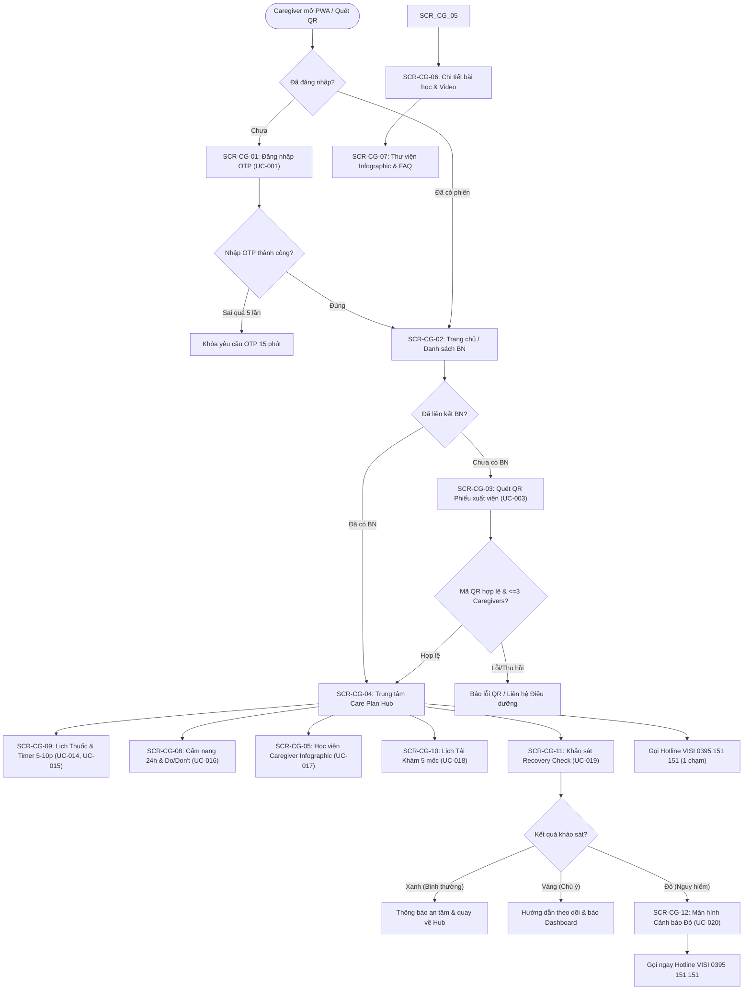
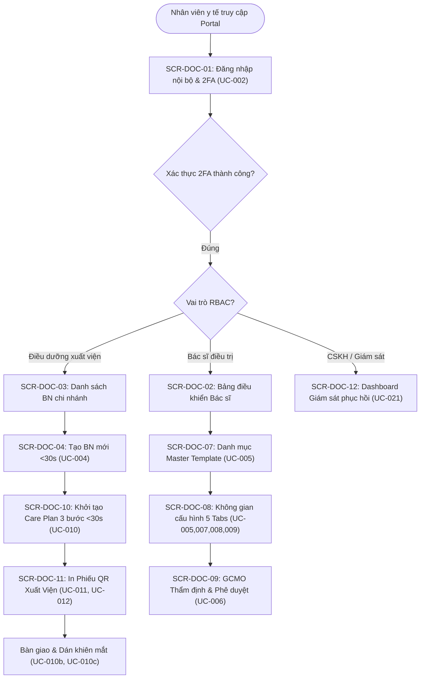
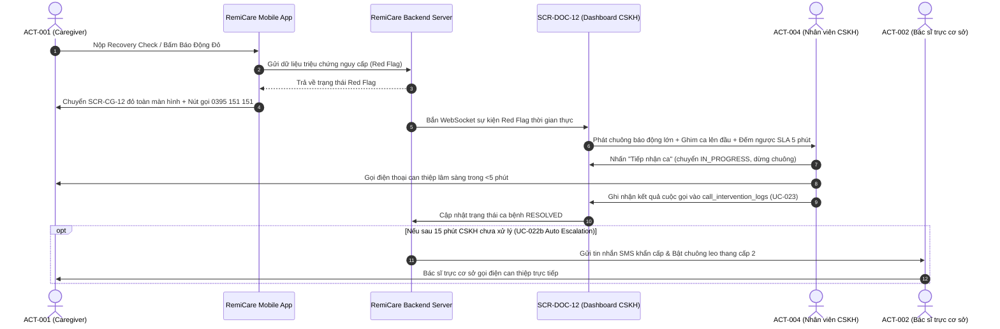

# 04. LUỒNG CHUYỂN ĐỘNG MÀN HÌNH (SCREEN FLOW SPECIFICATION)
# PHÂN HỆ NGƯỜI CHĂM SÓC & PHÂN HỆ BỆNH VIỆN — VISI MEDICAL GROUP

> **Dự án:** RemiCare Ophthalmic Post-Op Platform (Nền tảng Hướng dẫn và Giám sát Chăm sóc Hậu phẫu Nhãn khoa)  
> **Doanh nghiệp mục tiêu:** Công ty Cổ phần Tập đoàn Y khoa VISI (VISI Medical Group)  
> **Phiên bản:** V1 (Đồng bộ toàn diện theo tài liệu chuẩn US_US_V1 - Ánh xạ chuẩn hóa theo danh mục UC-001 đến UC-028)  
> **Ngày phê duyệt:** 15/09/2026  
> **Tiêu chuẩn UI/UX:** Mobile First (PWA), WCAG AAA Contrast (Accessibility), Zero Data Re-entry  

---

## 1. TỔNG QUAN & PHẠM VI LUỒNG MÀN HÌNH

Tài liệu này đặc tả kiến trúc luồng giao diện người dùng (Screen Flow) cho hai phân hệ cốt lõi của RemiCare, bảo đảm tính liên tục và trải nghiệm tối ưu:
1. **Phân hệ Ứng dụng Di động dành cho Người Chăm Sóc (Caregiver Mobile Web App / PWA):**
   * Tác nhân chính: `ACT-001` (Caregiver) và `ACT-006` (Bệnh nhân hậu phẫu thụ hưởng).
   * Thiết bị mục tiêu: Smartphone (iOS / Android), tối ưu hiển thị chữ to bản, tương phản cao, thao tác 1 chạm.
   * Nghiệp vụ trọng tâm: Đăng nhập OTP không mật khẩu (F-001), quét mã QR liên kết Care Plan trong <5s (F-004), lịch tra thuốc theo dòng thời gian kèm bộ đếm lùi giãn cách 5–10 phút (Drop Interval Buffer Timer - F-010), cẩm nang sống còn 24h đầu (F-012), bảng Do/Don't 2 cột màu (F-013), đánh giá phục hồi 3 mức (F-016) và nút gọi cấp cứu 1 chạm Hotline VISI `0395 151 151` (F-017).
2. **Phân hệ Cổng Thông Tin Y Tế Nội Bộ (Hospital Clinical Portal):**
   * Tác nhân: Bác sĩ điều trị (`ACT-002`), Điều dưỡng xuất viện (`ACT-003`), CSKH / Giám sát lâm sàng (`ACT-004`), GCMO (`ACT-005`), Admin (`ACT-007`).
   * Thiết bị mục tiêu: Máy tính để bàn (Desktop Web) tại phòng khám, quầy điều dưỡng phòng lưu viện và tổng đài CSKH tại 5 chi nhánh VISI.
   * Phân tầng trách nhiệm rõ ràng:
     * **Điều dưỡng quầy lưu viện:** Khởi tạo bệnh nhân và áp dụng Master Template trong <30 giây (F-005, F-008), in trực tiếp Phiếu xuất viện kèm mã QR sắc nét (F-022).
     * **Bác sĩ chuyên khoa:** Cấu hình trọn gói 5 tab Master Template (F-006, F-009, F-010, F-012, F-016), tùy biến liều lượng cá nhân hóa cho ca bệnh phức tạp.
     * **Nhân viên CSKH:** Thường trực Dashboard tiếp nhận cảnh báo Red Flag, cam kết can thiệp <5 phút (F-018, F-019), tự động leo thang sau 15 phút, ghi nhận nhật ký cuộc gọi (F-020).

---

## 2. DANH MỤC & ĐẶC TẢ CHI TIẾT 24 MÀN HÌNH GIAO DIỆN (SCREEN INVENTORY)

### PHÂN HỆ 1: NGƯỜI CHĂM SÓC (CAREGIVER SCREENS — 12 MÀN HÌNH)

#### `SCR-CG-01`: Đăng nhập OTP Caregiver (Caregiver Login)
* **Mã Use Case liên kết:** UC-001
* **Tính năng liên quan:** F-001, F-003
* **Tác nhân vận hành:** ACT-001 (Caregiver)
* **Các thành phần UI chính:** Ô nhập Số điện thoại di động Việt Nam; Nút 'Tiếp tục'; Ô nhập mã OTP 6 chữ số đếm ngược 5 phút; Nút 'Gửi lại mã OTP'; Thông báo điều khoản bảo mật theo NĐ 13/2023.
* **Luồng điều hướng & Hành vi:** Xác thực OTP thành công -> Điều hướng sang `SCR-CG-02` (Trang chủ) hoặc `SCR-CG-03` (nếu xuất phát từ việc quét mã QR trực tiếp bằng camera điện thoại).

#### `SCR-CG-02`: Trang chủ & Danh sách bệnh nhân (Caregiver Dashboard)
* **Mã Use Case liên kết:** UC-001, UC-003
* **Tính năng liên quan:** F-003, F-004
* **Tác nhân vận hành:** ACT-001 (Caregiver)
* **Các thành phần UI chính:** Thẻ thông tin bệnh nhân đang chăm sóc (Họ tên viết tắt, Mắt mổ, Loại mổ, Ngày hậu phẫu: Day X); Nút chuyển đổi hồ sơ bệnh nhân (hỗ trợ chăm sóc nhiều người); Nút 'Quét mã QR bệnh nhân mới'; Danh mục lối tắt: Lịch thuốc, Tái khám, Đánh giá hồi phục, Cẩm nang 24h, Hotline 0395 151 151.
* **Luồng điều hướng & Hành vi:** Nhấn thẻ bệnh nhân -> Điều hướng sang `SCR-CG-04`; Nhấn 'Quét QR mới' -> Điều hướng sang `SCR-CG-03`; Nhấn Hotline -> Gọi điện khẩn cấp.

#### `SCR-CG-03`: Quét mã QR liên kết bệnh nhân (QR Scanner)
* **Mã Use Case liên kết:** UC-003
* **Tính năng liên quan:** F-004, F-021
* **Tác nhân vận hành:** ACT-001 (Caregiver)
* **Các thành phần UI chính:** Khung ngắm quét mã QR toàn màn hình; Nút bật đèn flash hỗ trợ; Modal xem trước thông tin bệnh nhân giải mã từ token (Họ tên viết tắt, Năm sinh, Mắt phẫu thuật, Bác sĩ mổ); Nút 'Xác nhận liên kết'; Nút 'Hủy'.
* **Luồng điều hướng & Hành vi:** Quét thành công & Xác nhận -> Lưu liên kết, chuyển hướng sang `SCR-CG-04` (Trung tâm Care Plan).

#### `SCR-CG-04`: Trung tâm Kế Hoạch Chăm Sóc Bệnh Nhân (Patient Care Plan Hub)
* **Mã Use Case liên kết:** UC-003, UC-014, UC-016
* **Tính năng liên quan:** F-004, F-008, F-009, F-012
* **Tác nhân vận hành:** ACT-001 (Caregiver)
* **Các thành phần UI chính:** Banner nổi bật: Cẩm nang 24h đầu sống còn (Day 0–1); Thanh tiến trình hồi phục theo ngày (Day 1 -> Day 30); Tiện ích cữ thuốc tiếp theo kèm đồng hồ đếm lùi; Nút 'Làm bài kiểm tra phục hồi hôm nay' (nếu chưa nộp); Nút gọi 1 chạm Hotline VISI 0395 151 151.
* **Luồng điều hướng & Hành vi:** Nhấn cữ thuốc -> Sang `SCR-CG-09`; Nhấn khảo sát -> Sang `SCR-CG-11`; Nhấn Cẩm nang 24h -> Sang `SCR-CG-08`; Nhấn Học viện Caregiver -> Sang `SCR-CG-05`.

#### `SCR-CG-05`: Lộ trình bài học Học Viện Caregiver (Caregiver Academy Module List)
* **Mã Use Case liên kết:** UC-017
* **Tính năng liên quan:** F-014
* **Tác nhân vận hành:** ACT-001 (Caregiver)
* **Các thành phần UI chính:** Danh sách thẻ bài học trực quan chia theo giai đoạn hồi phục: (1) 24h đầu sống còn; (2) Tuần đầu vàng chống nhiễm khuẩn; (3) Giai đoạn ổn định thị lực (Tuần 2–4). Mỗi thẻ hiển thị tiêu đề, thời lượng đọc (1–2 phút), cờ trạng thái 'Đã xem' / 'Chưa xem'.
* **Luồng điều hướng & Hành vi:** Nhấn chọn bài học -> Điều hướng sang `SCR-CG-06`.

#### `SCR-CG-06`: Chi tiết bài học & Video/Infographic hướng dẫn (Lesson Detail & Media)
* **Mã Use Case liên kết:** UC-014, UC-017
* **Tính năng liên quan:** F-011, F-014
* **Tác nhân vận hành:** ACT-001 (Caregiver)
* **Các thành phần UI chính:** Trình phát video ngắn (15–30s) minh họa kỹ thuật kéo mi dưới không chạm đầu lọ; Infographic hướng dẫn 4 bước tra thuốc chuẩn vô trùng VISI; Nút 'Đã hiểu và hoàn thành bài học'.
* **Luồng điều hướng & Hành vi:** Nhấn hoàn thành -> Cập nhật tiến độ, quay về `SCR-CG-05` hoặc chuyển sang `SCR-CG-07`.

#### `SCR-CG-07`: Thư viện Infographic & Tra cứu Tình huống Khẩn cấp (Infographics & FAQ)
* **Mã Use Case liên kết:** UC-017, UC-024
* **Tính năng liên quan:** F-014, F-028
* **Tác nhân vận hành:** ACT-001 (Caregiver)
* **Các thành phần UI chính:** Thư viện hình ảnh Infographic tổng kết kiến thức chăm sóc mắt; Menu tra cứu nhanh các tình huống giật mình tại nhà: 'Dính nước vào mắt', 'Quên nhỏ thuốc', 'Mắt cộm xốn', 'Vô tình chạm tay vào mắt' kèm lời khuyên xử lý y khoa chuẩn VISI. *(Lưu ý: Bài kiểm tra Quiz trắc nghiệm được dời sang Phase 2 theo F-014)*.
* **Luồng điều hướng & Hành vi:** Chọn tình huống FAQ -> Mở popup hướng dẫn xử lý 3 bước; Nhấn Hotline -> Quay số 0395 151 151.

#### `SCR-CG-08`: Hướng dẫn Nên làm & Cần tránh (Do & Don't Guidelines)
* **Mã Use Case liên kết:** UC-016
* **Tính năng liên quan:** F-013
* **Tác nhân vận hành:** ACT-001 (Caregiver)
* **Các thành phần UI chính:** Bảng trực quan chia 2 cột màu: Cột Xanh lục (NÊN LÀM: đeo kính bảo hộ, uống thuốc đúng giờ) vs Cột Đỏ cờ (TUYỆT ĐỐI TRÁNH: không dụi mắt, không để nước vào mắt trong 7 ngày, kiêng cúi đầu xách nặng); Thanh lọc nhanh 4 nhóm sinh hoạt: Vệ sinh, Vận động, Ăn uống, Giấc ngủ.
* **Luồng điều hướng & Hành vi:** Nhấn thẻ mục -> Xem giải thích cơ chế y khoa và thời gian kiêng cữ.

#### `SCR-CG-09`: Lịch dùng thuốc & Bộ đếm giãn cách 5–10 phút (Medication Schedule & Timer)
* **Mã Use Case liên kết:** UC-014, UC-015
* **Tính năng liên quan:** F-009, F-010
* **Tác nhân vận hành:** ACT-001 (Caregiver)
* **Các thành phần UI chính:** Dòng thời gian cữ thuốc 4 khung giờ: Sáng (07:00), Trưa (11:30), Chiều (16:30), Tối (20:00). Thẻ thuốc hiển thị: Tên biệt dược, ảnh màu sắc nắp lọ, số giọt (1 giọt), mắt chỉ định (MP/MT); Nút 'Xác nhận đã nhỏ thuốc'; Bộ đếm lùi Drop Interval Buffer Timer 5–10 phút dạng vòng tròn động khóa lọ thuốc thứ 2; Âm thanh và rung báo hết giờ.
* **Luồng điều hướng & Hành vi:** Bấm xác nhận lọ 1 -> Khởi chạy timer đếm lùi 10 phút, khóa lọ 2; Hết giờ -> Báo chuông, mở khóa lọ 2 -> Bấm xác nhận hoàn tất cữ.

#### `SCR-CG-10`: Chi tiết lịch hẹn tái khám 5 mốc & Nhắc hẹn (Follow-up Tracker)
* **Mã Use Case liên kết:** UC-018
* **Tính năng liên quan:** F-015, F-027
* **Tác nhân vận hành:** ACT-001 (Caregiver)
* **Các thành phần UI chính:** Lộ trình 5 mốc tái khám chuẩn VISI: Day 1, Day 7, Month 1, Month 3, Month 6; Thẻ cuộc hẹn hiển thị ngày khám, tên Bác sĩ, địa chỉ chi nhánh Bệnh viện Mắt VISI đã mổ kèm bản đồ chỉ đường; Nút 'Xác nhận sẽ đến khám'; Nút 'Yêu cầu hỗ trợ đổi giờ khám'.
* **Luồng điều hướng & Hành vi:** Nhấn 'Xác nhận sẽ đến' -> Cập nhật trạng thái `CONFIRMED` lên Dashboard viện.

#### `SCR-CG-11`: Bảng kiểm phục hồi định kỳ 3 mức (Submit Recovery Check Survey)
* **Mã Use Case liên kết:** UC-019
* **Tính năng liên quan:** F-016
* **Tác nhân vận hành:** ACT-001 (Caregiver)
* **Các thành phần UI chính:** Form khảo sát 3–5 câu hỏi trắc nghiệm ngắn: (1) Mức độ đau nhức; (2) Độ nhìn rõ/mờ; (3) Mắt đỏ/chảy mủ; (4) Chớp sáng/ruồi bay; Nút 'Gửi đánh giá phục hồi'.
* **Luồng điều hướng & Hành vi:** Gửi form: Nếu Mức Xanh -> Hiển thị popup an tâm động viên (US-025); Nếu Mức Vàng -> Hiển thị lưu ý theo dõi; Nếu Mức Đỏ -> Chuyển lập tức sang `SCR-CG-12` (Cảnh báo Đỏ).

#### `SCR-CG-12`: Màn hình Xử lý Khẩn cấp Red Flag (Emergency Action & Hotline 0395 151 151)
* **Mã Use Case liên kết:** UC-020
* **Tính năng liên quan:** F-017
* **Tác nhân vận hành:** ACT-001 (Caregiver)
* **Các thành phần UI chính:** Giao diện cảnh báo đỏ toàn màn hình tương phản cao; Biểu tượng cấp cứu nhãn khoa; Hướng dẫn sơ cứu sống còn (Dán ngay khiên mắt bảo hộ, không nhỏ thêm thuốc, không dụi mắt); Nút bấm lớn 1 chạm: 'GỌI NGAY HOTLINE CẤP CỨU VISI: 0395 151 151'; Địa chỉ chi nhánh cấp cứu gần nhất.
* **Luồng điều hướng & Hành vi:** Chạm nút gọi -> Tự động quay số tổng đài VISI; Hệ thống đồng thời phát chuông báo động trên Dashboard CSKH cơ sở.

---

### PHÂN HỆ 2: CỔNG THÔNG TIN Y TẾ BỆNH VIỆN (HOSPITAL CLINICAL PORTAL — 12 MÀN HÌNH)

#### `SCR-DOC-01`: Đăng nhập Nhân viên Y tế Tập trung kết hợp 2FA (Staff Login)
* **Mã Use Case liên kết:** UC-002
* **Tính năng liên quan:** F-002, F-023
* **Tác nhân vận hành:** ACT-002 (Bác sĩ), ACT-003 (Điều dưỡng), ACT-004 (CSKH)
* **Các thành phần UI chính:** Ô nhập Tên đăng nhập / Mã nhân viên nội bộ; Ô nhập Mật khẩu; Ô nhập mã xác thực 2 lớp (2FA Authenticator / OTP); Dropdown hiển thị cơ sở bệnh viện trực thuộc (5 chi nhánh VISI); Nút 'Đăng nhập bảo mật'.
* **Luồng điều hướng & Hành vi:** Xác thực thành công -> Điều hướng theo vai trò RBAC: Bác sĩ -> `SCR-DOC-02` / `SCR-DOC-07`; Điều dưỡng -> `SCR-DOC-03` / `SCR-DOC-10`; CSKH -> `SCR-DOC-12`.

#### `SCR-DOC-02`: Bảng điều khiển Bác sĩ & Tổng quan Cơ sở (Clinical Doctor Dashboard)
* **Mã Use Case liên kết:** UC-002, UC-021
* **Tính năng liên quan:** F-002, F-018
* **Tác nhân vận hành:** ACT-002 (Bác sĩ điều trị)
* **Các thành phần UI chính:** Thống kê tổng quan: Số ca mổ trong ngày, Số bệnh nhân đang theo dõi hậu phẫu, Tỷ lệ tuân thủ thuốc trung bình chi nhánh, Cảnh báo ca cần hội chẩn chuyên môn; Lối tắt: Danh mục Master Template, Danh sách bệnh nhân mổ của tôi.
* **Luồng điều hướng & Hành vi:** Nhấn ca bệnh -> Sang `SCR-DOC-05`; Nhấn Master Template -> Sang `SCR-DOC-07`.

#### `SCR-DOC-03`: Danh sách & Tìm kiếm Hồ sơ Bệnh nhân theo Chi nhánh (Patient List)
* **Mã Use Case liên kết:** UC-004
* **Tính năng liên quan:** F-005
* **Tác nhân vận hành:** ACT-003 (Điều dưỡng), ACT-002 (Bác sĩ)
* **Các thành phần UI chính:** Thanh tìm kiếm theo Mã BN, Tên viết tắt, SĐT người nhà; Bộ lọc theo Ngày mổ, Loại phẫu thuật (Phaco/SILK), Bác sĩ phẫu thuật chính; Bảng dữ liệu hiển thị: Mã BN, Họ tên viết tắt, Mắt mổ, Trạng thái Care Plan (`PENDING`, `ACTIVE`, `COMPLETED`), Trạng thái QR (`ISSUED`, `LINKED`); Nút 'Tạo bệnh nhân mới'; Nút 'Khởi tạo Care Plan'.
* **Luồng điều hướng & Hành vi:** Nhấn 'Tạo mới' -> Mở `SCR-DOC-04`; Nhấn bệnh nhân -> Mở `SCR-DOC-05`; Nhấn 'Kích hoạt Care Plan' -> Mở `SCR-DOC-10`.

#### `SCR-DOC-04`: Tạo mới Hồ sơ Bệnh nhân (<30s) (Create Patient Record Form)
* **Mã Use Case liên kết:** UC-004
* **Tính năng liên quan:** F-005
* **Tác nhân vận hành:** ACT-003 (Điều dưỡng xuất viện)
* **Các thành phần UI chính:** Form tạo nhanh: Mã bệnh nhân HIS (nhập hoặc quét mã vạch hồ sơ bệnh án); Họ tên bệnh nhân (tự động chuyển viết tắt bảo mật NĐ 13); Năm sinh; Mắt phẫu thuật (Radio: Mắt Phải / Mắt Trái / Cả 2 mắt); Loại phẫu thuật (Dropdown: Phaco tiêu chuẩn / Laser SILK); Bác sĩ phẫu thuật chính (Dropdown); Nút 'Lưu & Sang Bước Kích Hoạt Care Plan'.
* **Luồng điều hướng & Hành vi:** Lưu thành công -> Tự động chuyển thẳng sang `SCR-DOC-10` trong vòng <1 giây.

#### `SCR-DOC-05`: Chi tiết Hồ sơ Bệnh nhân & Dòng Thời Gian Phục Hồi (Patient Record Details)
* **Mã Use Case liên kết:** UC-004, UC-021
* **Tính năng liên quan:** F-005, F-018
* **Tác nhân vận hành:** ACT-002 (Bác sĩ), ACT-003 (Điều dưỡng)
* **Các thành phần UI chính:** Thông tin hành chính lâm sàng; Care Plan hiện tại; Danh sách các Caregiver đã liên kết (tối đa 3); Lịch sử tuân thủ thuốc theo ngày (biểu đồ % đúng giờ); Lịch sử nộp Recovery Check hàng ngày; Lịch sử các cuộc gọi can thiệp của CSKH; Nút 'In lại phiếu QR' / 'Cấp lại QR'.
* **Luồng điều hướng & Hành vi:** Nhấn 'Cấp lại QR' -> Mở popup xác nhận cấp lại và chuyển sang `SCR-DOC-11`.

#### `SCR-DOC-06`: Chỉnh sửa Hồ sơ Bệnh nhân & Lưu trữ (Edit Patient Record)
* **Mã Use Case liên kết:** UC-004
* **Tính năng liên quan:** F-005
* **Tác nhân vận hành:** ACT-003 (Điều dưỡng), ACT-002 (Bác sĩ)
* **Các thành phần UI chính:** Form chỉnh sửa thông tin hành chính, ghi chú chẩn đoán bổ sung, đổi thông tin liên lạc người nhà; Nút 'Lưu thay đổi'; Nút 'Lưu trữ hồ sơ' (`ARCHIVED` - kiểm tra điều kiện không có Care Plan Active theo BR25).
* **Luồng điều hướng & Hành vi:** Lưu thành công -> Trở về `SCR-DOC-05`.

#### `SCR-DOC-07`: Danh mục Master Care Plan Template (Template Catalog)
* **Mã Use Case liên kết:** UC-005, UC-006
* **Tính năng liên quan:** F-006, F-007
* **Tác nhân vận hành:** ACT-002 (Bác sĩ), ACT-005 (GCMO)
* **Các thành phần UI chính:** Bảng quản trị các gói phác đồ mẫu: Tên template, Loại phẫu thuật áp dụng (Phaco, SILK), Phiên bản (v1.0, v1.1), Trạng thái vòng đời (`DRAFT`, `PENDING_APPROVAL`, `ACTIVE`, `ARCHIVED`), Ngày cập nhật, Người duyệt; Nút 'Tạo Template mới'; Nút 'Nhân bản phiên bản'.
* **Luồng điều hướng & Hành vi:** Nhấn Template -> Mở `SCR-DOC-08` (Cấu hình) hoặc `SCR-DOC-09` (Xem & Phê duyệt).

#### `SCR-DOC-08`: Không Gian Cấu Hình Master Template 5 Tabs (Master Workspace)
* **Mã Use Case liên kết:** UC-005, UC-007, UC-008, UC-009
* **Tính năng liên quan:** F-006, F-009, F-010, F-012, F-013, F-016, F-017, F-028
* **Tác nhân vận hành:** ACT-002 (Bác sĩ), ACT-005 (GCMO)
* **Các thành phần UI chính:** Thanh điều hướng 5 Tab chuyên môn: (Tab 1) Cẩm nang & Infographic Learning Path; (Tab 2) Danh mục thuốc mẫu & cài đặt Drop Interval Buffer Timer 5–10 phút; (Tab 3) Mốc thời gian & Bộ câu hỏi Recovery Check 3 mức; (Tab 4) Tiêu chí cảnh báo Red Flag & Cấu hình Hotline 0395 151 151; (Tab 5) Danh mục Do & Don't 2 cột màu và FAQ lâm sàng; Nút 'Lưu nháp'; Nút 'Gửi phê duyệt lâm sàng'.
* **Luồng điều hướng & Hành vi:** Lưu nháp -> Cập nhật trạng thái `DRAFT`; Gửi phê duyệt -> Chuyển sang `PENDING_APPROVAL` (UC-006).

#### `SCR-DOC-09`: Chi tiết & Vòng đời Phê Duyệt Template (Template Approval & Lifecycle)
* **Mã Use Case liên kết:** UC-005, UC-006
* **Tính năng liên quan:** F-006, F-007
* **Tác nhân vận hành:** ACT-005 (Clinical Approver / GCMO), ACT-002 (Bác sĩ)
* **Các thành phần UI chính:** Xem toàn diện cấu hình y khoa của Master Template; Khu vực thẩm định chuyên môn: Khung nhập nhận xét y khoa của GCMO; Nút 'Ký Duyệt & Ban Hành Toàn Chuỗi' (chuyển sang `ACTIVE`); Nút 'Yêu Cầu Chỉnh Sửa' (trả về `DRAFT`).
* **Luồng điều hướng & Hành vi:** Phê duyệt -> Ban hành áp dụng cho toàn bộ 5 chi nhánh bệnh viện VISI.

#### `SCR-DOC-10`: Khởi tạo & Tùy biến Care Plan Bệnh Nhân (<30s) (Patient Care Plan Setup)
* **Mã Use Case liên kết:** UC-010, UC-010b, UC-010c
* **Tính năng liên quan:** F-008
* **Tác nhân vận hành:** ACT-003 (Điều dưỡng xuất viện), ACT-002 (Bác sĩ)
* **Các thành phần UI chính:** Giao diện Clinical Setup 3 bước tinh gọn: Bước 1: Thông tin bệnh nhân đã chọn; Bước 2: Chọn Master Template phù hợp từ dropdown (hệ thống tự động nạp đơn thuốc và lịch tái khám); Bước 3: Xem trước phác đồ cá nhân hóa (cho phép Bác sĩ chỉnh sửa liều lượng độc lập theo BR18); Nút bấm lớn: 'KÍCH HOẠT CARE PLAN & IN PHIẾU QR (<30S)'.
* **Luồng điều hướng & Hành vi:** Kích hoạt thành công -> Chuyển Care Plan sang `ACTIVE`, tự động sinh token QR và chuyển sang `SCR-DOC-11`.

#### `SCR-DOC-11`: Phiếu Xuất Viện, In Mã QR & Cấp Lại QR (Discharge QR Slip Print)
* **Mã Use Case liên kết:** UC-011, UC-012, UC-013, UC-010b
* **Tính năng liên quan:** F-021, F-022
* **Tác nhân vận hành:** ACT-003 (Điều dưỡng xuất viện)
* **Các thành phần UI chính:** Xem trước Phiếu xuất viện khổ A5 ngang/A4 chuẩn VISI: Logo tập đoàn, Tên bệnh nhân viết tắt, Năm sinh, Mắt phẫu thuật, Bác sĩ mổ, Mã QR độ phân giải cao (≥300 DPI, ≥3x3 cm), Hướng dẫn quét 3 bước, Hotline 0395 151 151; Nút 'In Phiếu Ngay' (lệnh in 1 chạm ra máy in tại quầy); Nút 'Cấp lại mã QR mới' (thu hồi mã cũ `REVOKED` theo UC-013).
* **Luồng điều hướng & Hành vi:** Bấm in -> Máy in tại quầy xuất phiếu trong <3s; Bàn giao phiếu và hướng dẫn người nhà quét mã hoàn tất xuất viện (UC-010b, UC-010c).

#### `SCR-DOC-12`: Bảng Giám Sát Phục Hồi, Xử Lý Red Flag & Nhật Ký CSKH (Clinical Monitoring Dashboard)
* **Mã Use Case liên kết:** UC-021, UC-022, UC-022b, UC-023
* **Tính năng liên quan:** F-018, F-019, F-020
* **Tác nhân vận hành:** ACT-004 (CSKH / Medical Monitor), ACT-003 (Điều dưỡng), ACT-002 (Bác sĩ)
* **Các thành phần UI chính:** Bảng giám sát thời gian thực toàn chi nhánh: Phân tầng ưu tiên: (1) Ca Red Flag nhấp nháy đỏ kèm chuông cảnh báo lớn ghim trên đầu, hiển thị đồng hồ đếm ngược SLA 5 phút; (2) Ca Cờ Vàng cần chú ý; (3) Ca Cờ Xanh ổn định; Nút 'Tiếp nhận ca Red Flag'; Modal popup 'Ghi nhận cuộc gọi can thiệp' (thời lượng, tình trạng, hướng xử lý); Chỉ số leo thang quá hạn 15 phút.
* **Luồng điều hướng & Hành vi:** Tiếp nhận ca -> Dừng chuông, mở form gọi điện; Hoàn thành cuộc gọi -> Lưu `call_intervention_logs`, đổi trạng thái sang `RESOLVED`.

---

## 3. SƠ ĐỒ SCREEN FLOW DIAGRAM TỔNG THỂ (MERMAID DIAGRAMS)

### 3.1 Sơ Đồ Luồng Màn Hình Phân Hệ Caregiver (Mobile Web App / PWA)

---

### 3.2 Sơ Đồ Luồng Màn Hình Phân Hệ Bệnh Viện (Clinical Portal Flow)

---

### 3.3 Sơ Đồ Tương Tác Cảnh Báo Khẩn Cấp Chéo & Cam Kết SLA (Red Flag & SLA Escalation Flow)

