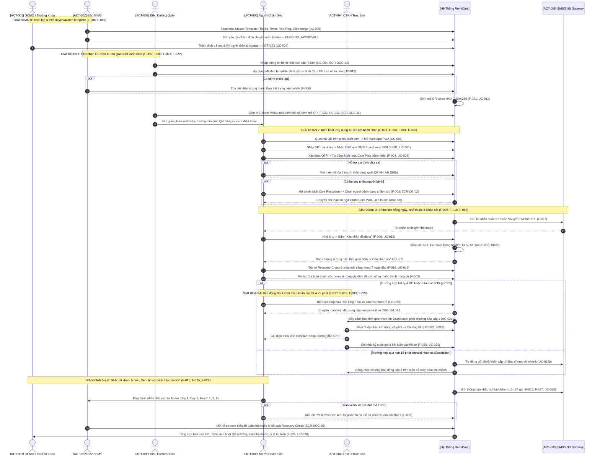

# 08. ĐẶC TẢ LUỒNG VẬN HÀNH HỆ THỐNG XUYÊN SUỐT THEO TÍNH NĂNG (END-TO-END OPERATIONAL WORKFLOW & FEATURE TRACEABILITY)
# HỆ THỐNG REMICARE OPHTHALMIC POST-OP PLATFORM

> **Dự án:** RemiCare Ophthalmic Post-Op Platform (Nền tảng Hướng dẫn và Giám sát Chăm sóc Hậu phẫu Nhãn khoa)  
> **Doanh nghiệp mục tiêu:** Công ty Cổ phần Tập đoàn Y khoa VISI (VISI Medical Group)  
> **Phiên bản tài liệu:** V1 (Chuẩn hóa toàn diện — Khớp nối 100% với 28 Features, 10 Actors, 31 Use Cases và 26 Business Rules)  
> **Hệ thống áp dụng:** Chuỗi 5 bệnh viện VISI (Thủ Đức, Hải Phòng, Đà Nẵng, Cần Thơ, Hà Nội)  
> **Ngày phê duyệt:** 16/09/2026  
> **Mục tiêu tài liệu:** Cung cấp bức tranh vận hành toàn diện, khép kín từ lúc tiền phẫu, lưu viện xuất viện, chăm sóc hằng ngày tại nhà cho đến tái khám định kỳ và đánh giá hiệu quả điều trị. Mọi bước vận hành đều được truy vết trực tiếp tới từng **Feature (`F-001` đến `F-028`)**, **Tác nhân (`ACT-001` đến `ACT-010`)**, **Màn hình giao diện (`SCR-CG-xx`, `SCR-DOC-xx`)**, **Use Case (`UC-xxx`)** và **Quy tắc nghiệp vụ y tế (`BR1` đến `BR26`)**.

---

## 1. NGUYÊN TẮC THIẾT KẾ VẬN HÀNH (OPERATIONAL PRINCIPLES)

1. **Khép Kín Toàn Diện & Không Gãy Đứt (Closed-Loop Care Delivery):** Quy trình tạo thành vòng lặp khép kín: *Cấu hình mẫu chuẩn (Viện) -> Bàn giao xuất viện số hóa <30s (Viện) -> Chăm sóc và nộp dữ liệu hằng ngày (Nhà) -> Giám sát và can thiệp khẩn cấp <5p (Viện) -> Tái khám 5 mốc & Tổng kết KPI (Viện)*.
2. **Khớp Nối 100% Danh Mục 28 Features (`F-001` đến `F-028`):** Không có tính năng nào bị cô lập ngoài quy trình vận hành thực tế. Từng tính năng đều được đặt vào đúng thời điểm, đúng tác nhân và đúng luồng xử lý.
3. **Tuân Thủ Pháp Lý Bảo Vệ Dữ Liệu Y Tế (Nghị định 13/2023/NĐ-CP):**
   * Bệnh nhân hiển thị dưới dạng tên viết tắt bảo mật (`display_name: Ng. V. An`) trên mọi giao diện công khai và phiếu in xuất viện.
   * Mã QR chỉ chứa token mã hóa ngẫu nhiên (HMAC UUIDv4), không lưu dữ liệu thô bệnh án trên mã.
   * Chặn hoàn toàn luồng tự do đăng ký tài khoản nhân viên y tế từ internet; kiểm soát truy cập nghiêm ngặt theo mô hình RBAC 5 cơ sở (BR26).
4. **Chuẩn Mực Dược Lý Nhãn Khoa & Cam Kết SLA Cấp Cứu Khung Giờ Vàng:**
   * Tự động kích hoạt **Bộ đếm thời gian giãn cách 5–10 phút (Drop Interval Buffer Timer)** chống hiện tượng rửa trôi thuốc (washout effect) giữa các loại thuốc nhỏ mắt (BR23).
   * Cam kết tiếp nhận và gọi điện can thiệp sự cố **Red Flag trong <5 phút (SLA <5p)**; tự động kích hoạt **Leo thang cấp cứu (Escalation Daemon) sau 15 phút** nếu quá hạn chưa xử lý (BR12).
5. **Tối Ưu Hóa Trải Nghiệm Thân Nhân & Bệnh Nhân Lớn Tuổi:**
   * Đăng nhập không mật khẩu (Passwordless OTP) qua số điện thoại; mở ứng dụng tức thì bằng Web App (PWA) không cần cài đặt.
   * Chế độ trợ năng nhãn khoa chuyên dụng: Chữ to bản (≥18pt), tương phản cao (High Contrast), nút bấm lớn (≥48px) và Audio Guide đọc tiếng Việt tự nhiên (F-026).

---

## 2. MA TRẬN ÁNH XẠ XUYÊN SUỐT 28 FEATURES VÀO CÁC GIAI ĐOẠN VẬN HÀNH

| Feature ID | Tên Tính Năng (Feature Description) | Giai Đoạn Vận Hành | Tác Nhân Chính | Màn Hình Đối Ứng | Use Case Liên Kết | Quy Tắc Nghiệp Vụ |
| :--- | :--- | :---: | :---: | :---: | :---: | :---: |
| **F-001** | Xác thực Người Chăm Sóc qua OTP (Caregiver Auth) | Giai đoạn 2 | ACT-005 (Caregiver) | `SCR-CG-01` | UC-001 | BR1, BR2, BR3 |
| **F-002** | Xác thực Nhân Viên Y Tế Tập Trung (Staff RBAC) | Giai đoạn 0 | ACT-001, 002, 003, 004 | `SCR-DOC-01`, `02` | UC-002, UC-026 | BR-NEW-05 |
| **F-003** | **Quản lý Hồ sơ Caregiver, Lựa Chọn Care Recipient & Lịch Sử Chăm Sóc:** Hỗ trợ 1 Caregiver chăm sóc nhiều bệnh nhân; chuyển đổi ngữ cảnh người bệnh 1 chạm; tra cứu toàn diện dòng thời gian cữ thuốc đa thân nhân và lịch sử các ca mổ đã hoàn thành trong quá khứ. | Giai đoạn 2, 3, 5 | ACT-005 (Caregiver) | `SCR-CG-02`, `04` | UC-001, UC-003 | BR4, BR5, BR-NEW-03 |
| **F-004** | Liên kết Caregiver - Bệnh nhân qua QR (<5s) | Giai đoạn 2 | ACT-005 (Caregiver) | `SCR-CG-03` | UC-003 | BR4, BR5 (Max 3) |
| **F-005** | Quản lý Hồ sơ Bệnh Nhân Hậu Phẫu (<30s) | Giai đoạn 1 | ACT-003 (Điều dưỡng) | `SCR-DOC-03`, `04` | UC-004 | BR16, BR25, NĐ 13 |
| **F-006** | Quản lý Mẫu Phác Đồ Master Template (5 Tabs) | Giai đoạn 0 | ACT-002 (Bác sĩ) | `SCR-DOC-07`, `08` | UC-005, UC-007..009 | BR15, BR17 |
| **F-007** | Phê Duyệt Lâm Sàng Master Template (GCMO) | Giai đoạn 0 | ACT-001 (GCMO) | `SCR-DOC-09` | UC-006 | BR15 (Ký số) |
| **F-008** | Khởi Tạo & Kích Hoạt Care Plan Cá Nhân Hóa | Giai đoạn 1 | ACT-003, ACT-002 | `SCR-DOC-10` | UC-010, UC-010b | BR18 (<30s) |
| **F-009** | Lịch Uống và Nhỏ Thuốc Hậu Phẫu (4 Khung Giờ) | Giai đoạn 3 | ACT-005, ACT-007 | `SCR-CG-04`, `09` | UC-014, UC-015 | BR19 |
| **F-010** | Bộ Đếm Lùi Giãn Cách 5–10 Phút (Buffer Timer) | Giai đoạn 3 | ACT-005, ACT-007 | `SCR-CG-09` | UC-015 | BR23 (Chống trôi) |
| **F-011** | Cẩm Nang Hướng Dẫn Thao Tác Kéo Mi Nhỏ Thuốc | Giai đoạn 3 | ACT-005, ACT-007 | `SCR-CG-06` | UC-014, UC-017 | BR8 (Vô trùng) |
| **F-012** | Cẩm Nang Chăm Sóc Đặc Biệt 24 Giờ Đầu Sau Mổ | Giai đoạn 3 | ACT-005, ACT-007 | `SCR-CG-04`, `08` | UC-016 | BR6 (Sống còn 24h) |
| **F-013** | Quy Tắc Sinh Hoạt Nên Làm & Cần Tránh (2 Cột Màu)| Giai đoạn 3 | ACT-005, ACT-007 | `SCR-CG-08` | UC-016 | BR7 (Do/Don't) |
| **F-014** | Học Viện Caregiver Tinh Gọn (Infographics) | Giai đoạn 3 | ACT-005 (Caregiver) | `SCR-CG-05`, `06` | UC-017 | Loại bỏ quiz MVP |
| **F-015** | Quản Lý và Nhắc Lịch Tái Khám 5 Mốc Chuẩn VISI| Giai đoạn 5 | ACT-005, ACT-004 | `SCR-CG-10`, `DOC-05`| UC-018 | BR13, BR14 |
| **F-016** | Đánh Giá Phục Hồi Định Kỳ (Recovery Check 3 Mức)| Giai đoạn 3 | ACT-005, ACT-007 | `SCR-CG-11` | UC-019 | BR24 (Xanh/Vàng/Đỏ) |
| **F-017** | Cảnh Báo Cấp Cứu Red Flag & Hotline 0395 151 151| Giai đoạn 4 | ACT-005, ACT-007 | `SCR-CG-12` | UC-020 | BR10, BR11 (1 chạm) |
| **F-018** | Bảng Giám Sát Lâm Sàng Tập Trung 5 Chi Nhánh | Giai đoạn 4 | ACT-004, ACT-003 | `SCR-DOC-12` | UC-021 | BR26 (Multi-Branch) |
| **F-019** | Tiếp Nhận, Xử Lý & Tự Động Leo Thang Cảnh Báo | Giai đoạn 4 | ACT-004, Hệ thống | `SCR-DOC-12` | UC-022, UC-022b | BR12 (SLA 5p, Esc 15p)|
| **F-020** | Ghi Nhận Nhật Ký Cuộc Gọi Can Thiệp (Call Logs) | Giai đoạn 4 | ACT-004 (CSKH) | `SCR-DOC-12` | UC-023 | Bảng `call_logs` |
| **F-021** | Sinh Mã QR và Quản Lý Vòng Đời QR Token | Giai đoạn 1 | ACT-003, Hệ thống | `SCR-DOC-10` | UC-011 | BR18, HMAC-SHA256 |
| **F-022** | In Phiếu Xuất Viện Kèm QR & Cấp Lại/Thu Hồi QR | Giai đoạn 1, 5| ACT-003 (Điều dưỡng) | `SCR-DOC-11` | UC-012, UC-013 | In <3s, Cấp lại <5s |
| **F-023** | Quản Lý Tài Khoản Nhân Viên & Phân Quyền Cơ Sở | Giai đoạn 0 | ACT-006 (Admin) | `SCR-DOC-01` | UC-026 | RBAC 7 vai trò |
| **F-024** | Nhật Ký Kiểm Toán & Truy Vết Hoạt Động (Audit) | Giai đoạn 6 | ACT-006, Thanh tra | API Backend | UC-027 | Bảng `audit_logs` |
| **F-025** | Báo Cáo Vận Hành & Chỉ Số Tuân Thủ KPI Bệnh Viện| Giai đoạn 6 | ACT-001 (GCMO/Lãnh đạo)| `SCR-DOC-12` | UC-028 | KPI Kích hoạt ≥85% |
| **F-026** | Chế Độ Trợ Năng Giao Diện Nhãn Khoa (A11y Mode) | Giai đoạn 2 | ACT-007, ACT-005 | `SCR-CG-04`, `11` | UC-025 | Chữ ≥18pt, Audio |
| **F-027** | Cổng Thông Báo Tự Động Đa Kênh (SMS/ZNS/Push) | Giai đoạn 3, 5| ACT-009 (Gateway) | Hệ thống nền | UC-014, 015, 018 | Brandname 'VISI' |
| **F-028** | Tra Cứu Tình Huống Khẩn Cấp & FAQ Lâm Sàng | Giai đoạn 3 | ACT-005, ACT-007 | `SCR-CG-07` | UC-024 | Tri thức kiểm duyệt |

---

## 3. SƠ ĐỒ LUỒNG VẬN HÀNH HỆ THỐNG TỔNG THỂ (MERMAID SWIMLANE FLOWCHART)

---

## 4. ĐẶC TẢ CHI TIẾT 6 GIAI ĐOẠN VẬN HÀNH KHÉP KÍN

### GIAI ĐOẠN 0: KHỞI TẠO CẤU HÌNH HỆ THỐNG & QUẢN TRỊ ĐA CHI NHÁNH
*Mục tiêu:* Thiết lập nền tảng kỹ thuật số vững chắc, bảo đảm tính sẵn sàng của 5 cơ sở VISI trước khi tiếp nhận bệnh nhân.

#### Bước 0.1: Quản trị tài khoản nhân viên & phân quyền cơ sở (`F-002`, `F-023`)
* **Tác nhân thực hiện:** `ACT-006` (Admin Hệ thống).
* **Màn hình giao diện:** `SCR-DOC-01` (Đăng nhập Admin) -> Phân hệ Quản trị Nhân sự.
* **Hành động vận hành:**
  1. Admin tạo tài khoản nhân sự với định danh Email VISI, Họ tên, SĐT và gán chính xác vai trò RBAC (`DOCTOR`, `NURSE`, `CSKH`, `GCMO`) cùng cơ sở trực thuộc (`VISI-TD`, `VISI-HP`, `VISI-DN`, `VISI-CT`, `VISI-HN`).
  2. Hệ thống cấp mật khẩu tạm thời ngẫu nhiên; kích hoạt chế độ xác thực 2 lớp (2FA TOTP/SMS) bắt buộc đối với Bác sĩ và GCMO (BR-NEW-05).
  3. Áp dụng quy tắc cô lập dữ liệu đa chi nhánh (**BR26**): Nhân viên thuộc chi nhánh nào chỉ được phép truy vấn dữ liệu bệnh nhân và nhận cảnh báo phát sinh tại chi nhánh đó.

#### Bước 0.2: Bác sĩ xây dựng Master Care Plan Template chuẩn hóa (`F-006`)
* **Tác nhân thực hiện:** `ACT-002` (Bác sĩ Chuyên khoa Nhãn khoa).
* **Màn hình giao diện:** `SCR-DOC-07` (Danh mục Template) -> `SCR-DOC-08` (Không gian cấu hình 5 Tabs).
* **Hành động vận hành:**
  1. Bác sĩ chọn gói phẫu thuật (MVP tập trung 2 mẫu: *Phaco tiêu chuẩn* và *Laser xóa cận SILK/ELITA*).
  2. Cấu hình **Tab 1 - Thông tin chung**: Tên phác đồ, số ngày theo dõi hậu phẫu (mặc định 30 ngày).
  3. Cấu hình **Tab 2 - Danh mục thuốc mẫu (`F-009`, `F-010`)**: Thiết lập tên biệt dược, dạng bào chế, liều lượng, mắt mổ chỉ định, 4 khung giờ tra thuốc (Sáng: 08:00, Trưa: 12:00, Chiều: 16:00, Tối: 20:00) và cài đặt **Bộ đếm thời gian giãn cách `buffer_interval_minutes` từ 5–10 phút** đối với thuốc nhỏ mắt (BR23).
  4. Cấu hình **Tab 3 - Recovery Check & Red Flags (`F-016`, `F-017`)**: Nhập bộ câu hỏi sàng lọc 3–5 câu theo 3 mức Xanh/Vàng/Đỏ; thiết lập các dấu hiệu Báo động Đỏ tối khẩn kèm số hotline viện `0395 151 151` và cam kết SLA 5 phút.
  5. Cấu hình **Tab 4 - Cẩm nang 24h, Do/Don't & FAQ (`F-011`, `F-012`, `F-013`, `F-028`)**: Đính kèm nội dung cẩm nang sống còn 24h đầu, bảng Do/Don't 2 cột màu (kiêng nước 7 ngày, kiêng dụi mắt), infographic lộ trình hồi phục và danh mục câu hỏi thường gặp FAQ.
  6. Lưu bản thảo ở trạng thái `DRAFT` (phiên bản `v1.0`).

#### Bước 0.3: Giám đốc Chuyên môn (GCMO) thẩm định y khoa & ký duyệt điện tử (`F-007`)
* **Tác nhân thực hiện:** `ACT-001` (Giám đốc Chuyên môn Tập đoàn - BS.CKII Trần Bá Kiền).
* **Màn hình giao diện:** `SCR-DOC-09` (Chi tiết & Thẩm định Phê duyệt Template).
* **Hành động vận hành:**
  1. Bác sĩ bấm "Gửi phê duyệt", template chuyển trạng thái sang `PENDING_APPROVAL` (UC-006.1).
  2. GCMO rà soát toàn bộ cấu hình dược lý, bộ đếm timer và câu hỏi cảnh báo.
  3. GCMO nhập nhận xét chuyên môn, nhập mã PIN ký duyệt số hóa và bấm "KÝ DUYỆT & BAN HÀNH TOÀN CHUỖI".
  4. Hệ thống cập nhật trạng thái `ACTIVE`, ghi nhận `approved_by` và `approved_at` (BR15). Kể từ thời điểm này, toàn bộ 5 bệnh viện VISI được phép sử dụng template để xuất viện bệnh nhân.

---

### GIAI ĐOẠN 1: TIẾP NHẬN & BÀN GIAO XUẤT VIỆN TẠI PHÒNG LƯU VIỆN (<30 GIÂY)
*Mục tiêu:* Số hóa hoàn toàn thủ tục xuất viện, giảm thời gian dặn dò thủ công từ 15 phút xuống dưới 30 giây, loại bỏ hoàn toàn nguy cơ mất giấy dặn dò.

#### Bước 1.1: Điều dưỡng tiếp nhận hồ sơ bệnh nhân hậu phẫu (`F-005`)
* **Tác nhân thực hiện:** `ACT-003` (Điều dưỡng Quầy Lưu viện).
* **Màn hình giao diện:** `SCR-DOC-03` (Danh sách Bệnh nhân) -> `SCR-DOC-04` (Tạo mới Hồ sơ Bệnh nhân <30s).
* **Hành động vận hành:**
  1. Ngay khi bệnh nhân từ phòng mổ chuyển về phòng hồi tỉnh, Điều dưỡng mở form tạo nhanh `SCR-DOC-04`.
  2. Nhập thông tin tối thiểu: Quét mã hồ sơ bệnh án HIS, nhập Họ tên bệnh nhân (hệ thống tự động mã hóa thành tên viết tắt bảo mật theo NĐ 13/2023: ví dụ "Trần Văn Bình" -> "Tr. V. Bình"), Năm sinh, Giới tính, Số điện thoại người nhà, Mắt phẫu thuật (MP/MT/Hai mắt), Loại phẫu thuật và Bác sĩ mổ chính.
  3. Bấm "Lưu & Sang Bước Kích Hoạt Care Plan". Thời gian hoàn thành thao tác: <15 giây.

#### Bước 1.2: Kích hoạt Care Plan cá nhân hóa 3 bước (<30 giây) (`F-008`)
* **Tác nhân thực hiện:** `ACT-003` (Điều dưỡng Quầy Lưu viện) phối hợp `ACT-002` (Bác sĩ).
* **Màn hình giao diện:** `SCR-DOC-10` (Khởi tạo & Tùy biến Care Plan Bệnh nhân).
* **Hành động vận hành:**
  1. **Bước 1 (Chọn Template):** Điều dưỡng chọn Master Template đã được GCMO duyệt tương ứng với loại mổ của bệnh nhân (ví dụ: *Phác đồ Phaco VISI Chuẩn v1.0*).
  2. **Bước 2 (Xem trước phác đồ):** Hệ thống tự động nhân bản trọn gói danh mục thuốc, lịch tra thuốc, bộ đếm đệm 5–10 phút và lịch 5 mốc tái khám chuẩn VISI (Day 1, Day 7, Month 1, Month 3, Month 6) vào hồ sơ bệnh nhân (BR18).
  3. **Bước 3 (Ngoại lệ lâm sàng nếu có - Bác sĩ tùy biến):** Nếu bệnh nhân có phản ứng viêm tiền phòng mạnh hoặc cơ địa đặc biệt, Bác sĩ điều trị có quyền chỉnh sửa trực tiếp liều lượng thuốc (ví dụ: tăng Pred Forte từ 4 lần lên 6 lần/ngày) trên màn hình này mà tuyệt đối không làm ảnh hưởng đến Master Template gốc.
  4. Điều dưỡng bấm nút lớn: **"KÍCH HOẠT CARE PLAN & IN PHIẾU QR (<30S)"**. Hệ thống chuyển Care Plan sang trạng thái `ACTIVE`.

#### Bước 1.3: Sinh mã QR token bảo mật và in Phiếu xuất viện 1 chạm (`F-021`, `F-022`)
* **Tác nhân thực hiện:** `ACT-003` (Điều dưỡng Quầy Lưu viện).
* **Màn hình giao diện:** `SCR-DOC-11` (Phiếu Xuất Viện & In Mã QR).
* **Hành động vận hành:**
  1. Hệ thống tự động sinh chuỗi token ngẫu nhiên bảo mật HMAC-SHA256 (UUIDv4) gắn liền với Care Plan, hiệu lực 30 ngày (BR18).
  2. Render bản xem trước Phiếu xuất viện chuẩn khổ A5 ngang / A4 mang thương hiệu VISI Medical Group: Logo bệnh viện, Tên viết tắt bệnh nhân, Năm sinh, Mắt phẫu thuật, Bác sĩ mổ, Mã QR sắc nét kích thước chuẩn ≥3x3 cm, hotline cấp cứu 24/7 `0395 151 151` và 3 bước hướng dẫn quét mã.
  3. Điều dưỡng bấm "In Phiếu Ngay", máy in tại quầy xuất bản in sắc nét trong vòng <3 giây.
  4. Điều dưỡng trao phiếu in tận tay người nhà (Caregiver), dặn dò quét mã bằng camera điện thoại để truy cập toàn bộ phác đồ điều trị.

---

### GIAI ĐOẠN 2: THÂN NHÂN KÍCH HOẠT ỨNG DỤNG & LIÊN KẾT BỆNH NHÂN TẠI NHÀ
*Mục tiêu:* Đưa người chăm sóc vào hệ sinh thái RemiCare trong vòng <5 giây mà không cần cài đặt ứng dụng phức tạp, bảo đảm tính pháp lý và trợ năng tối ưu.

#### Bước 2.1: Quét mã QR xuất viện & Mở ứng dụng PWA (`F-001`, `F-004`)
* **Tác nhân thực hiện:** `ACT-005` (Người Chăm Sóc / Caregiver) hoặc `ACT-007` (Bệnh Nhân).
* **Màn hình giao diện:** Camera điện thoại -> Trình duyệt Web PWA (`SCR-CG-01`).
* **Hành động vận hành:**
  1. Caregiver mở ứng dụng Camera có sẵn trên smartphone (iPhone / Android) hoặc Zalo quét mã QR in trên Phiếu xuất viện.
  2. Trình duyệt tự động mở đường dẫn an toàn: `https://pwa.remicare.visi.vn/claim?token=<QR_TOKEN>`. Không yêu cầu tải ứng dụng từ App Store / Google Play.

#### Bước 2.2: Đăng nhập OTP không mật khẩu (`F-001`, `F-003`)
* **Tác nhân thực hiện:** `ACT-005` (Người Chăm Sóc).
* **Màn hình giao diện:** `SCR-CG-01` (Đăng nhập OTP Caregiver).
* **Hành động vận hành:**
  1. Caregiver nhập Số điện thoại di động chính chủ (10 chữ số chuẩn Việt Nam, BR1).
  2. Bấm "Tiếp tục". Cổng viễn thông (`ACT-009`) gửi tin nhắn SMS Brandname "VISI GROUP" hoặc Zalo ZNS chứa mã OTP 6 chữ số trong vòng <10 giây (BR2).
  3. Caregiver nhập mã OTP. Nếu đúng, hệ thống tạo hồ sơ định danh Caregiver Profile (`F-003`) và duy trì phiên làm việc an toàn (Keep-Alive Token, BR3).
  4. *Cơ chế phòng thủ (Rate Limiting):* Nếu nhập sai quá 5 lần liên tiếp, hệ thống tự động khóa yêu cầu trong 15 phút để chống tấn công brute-force.

#### Bước 2.3: Xác nhận liên kết hồ sơ & Phân quyền tối đa 3 Caregiver (`F-004`)
* **Tác nhân thực hiện:** `ACT-005` (Người Chăm Sóc).
* **Màn hình giao diện:** `SCR-CG-03` (Xác nhận liên kết QR) -> `SCR-CG-04` (Trung tâm Kế Hoạch Chăm Sóc).
* **Hành động vận hành:**
  1. Hệ thống giải mã QR token và hiển thị thẻ tóm tắt bệnh nhân: Tên viết tắt (`Tr. V. Bình`), Mắt mổ (`Mắt Phải`), Ngày phẫu thuật (`Hôm nay`), Bác sĩ mổ (`BS.CKII Trần Bá Kiền`).
  2. Caregiver chọn mối quan hệ với bệnh nhân (Con cái / Vợ chồng / Bố mẹ / Thân nhân khác) và bấm "Xác Nhận Chăm Sóc".
  3. Hệ thống ghi nhận liên kết vào bảng `caregiver_patient_links`.
  4. **Quy tắc chia ca gia đình (BR5):** Hệ thống cho phép tối đa 03 Caregiver cùng liên kết vào 1 bệnh nhân. Người thứ hai và thứ ba chỉ cần quét lại cùng mã QR và đăng nhập số điện thoại của họ. Toàn bộ lịch sử dùng thuốc và thông báo sẽ được đồng bộ tức thì giữa cả 3 người.
  5. Nếu người thứ tư quét mã, hệ thống từ chối và hướng dẫn liên hệ quầy điều dưỡng viện.

#### Bước 2.3b: Lựa chọn Care Recipient & Chuyển đổi ngữ cảnh chăm sóc đa bệnh nhân (`F-003`)
* **Tác nhân thực hiện:** `ACT-005` (Người Chăm Sóc).
* **Màn hình giao diện:** `SCR-CG-02` (Trang chủ & Danh sách Bệnh nhân) -> `SCR-CG-04` (Trung tâm Kế Hoạch Chăm Sóc).
* **Hành động vận hành:**
  1. **Trường hợp Caregiver chỉ có 1 bệnh nhân:** Sau khi xác thực OTP thành công, hệ thống tự động đưa thẳng người dùng vào màn hình chính `SCR-CG-04` của bệnh nhân đó để giảm thiểu thao tác chạm.
  2. **Trường hợp Caregiver chăm sóc nhiều bệnh nhân (Multi-Patient Management):** (Ví dụ: Chăm sóc cả Bố mổ Phaco mắt phải và Mẹ mổ SILK mắt trái):
     * Màn hình `SCR-CG-02` hiển thị danh sách các thẻ bệnh nhân đang hoạt động (`Active Care Recipients`).
     * Mỗi thẻ hiển thị đầy đủ thông tin nhận diện nhanh: Họ tên viết tắt (`display_name: Ng. V. An`), Mắt phẫu thuật (MP/MT), Loại mổ (Phaco/SILK), Ngày hậu phẫu (`Day X`), và Trạng thái hoàn thành cữ thuốc trong ngày.
     * Caregiver bấm chọn bệnh nhân nào -> Hệ thống thực hiện **Chuyển đổi ngữ cảnh làm việc (Switch Active Context)** tức thì trong session.
     * Toàn bộ dữ liệu hiển thị tại các màn hình con (`SCR-CG-04` Hub, `SCR-CG-09` Lịch thuốc, `SCR-CG-11` Khảo sát, `SCR-CG-10` Lịch tái khám) được lọc chính xác theo bệnh nhân đang kích hoạt.
  3. **Bộ chuyển đổi nhanh trên Header (Care Recipient Switcher):** Tại mọi màn hình, thanh tiêu đề luôn có nút dropdown hiển thị tên bệnh nhân đang chọn kèm avatar mắt mổ; Caregiver chỉ cần chạm nhẹ để đổi sang người thân khác trong vòng 1 chạm mà không cần quay lại trang chủ.

#### Bước 2.4: Bật chế độ Trợ năng nhãn khoa (Ophthalmic Accessibility Mode) (`F-026`)
* **Tác nhân thực hiện:** `ACT-007` (Bệnh Nhân) hoặc Caregiver hỗ trợ.
* **Màn hình giao diện:** `SCR-CG-04` (Cài đặt Trợ năng) -> `SCR-CG-11`.
* **Hành động vận hành:**
  1. Nhấn nút biểu tượng Trợ Năng trên thanh tiêu đề ứng dụng.
  2. Hệ thống cung cấp các tùy chọn nhãn khoa cao cấp:
     * **Cỡ chữ siêu lớn (Font Scaling):** Tăng kích thước phông chữ lên 140% – 160% (≥18pt).
     * **Tương phản cao (High Contrast):** Chuyển giao diện sang nền đen chữ vàng đậm hoặc nền trắng chữ đen tuyền, loại bỏ hoàn toàn các yếu tố gây lóa mắt.
     * **Audio Guide (Đọc tự động tiếng Việt):** Nhấn nút loa để nghe giọng đọc hướng dẫn cữ thuốc và cẩm nang mà không cần nhìn vào màn hình điện thoại.

---

### GIAI ĐOẠN 3: VẬN HÀNH CHĂM SÓC HỒI PHỤC HẰNG NGÀY (DAILY RECOVERY ROUTINE)
*Mục tiêu:* Hướng dẫn chuẩn xác từng cữ thuốc, bảo đảm dược động học nhãn khoa qua bộ đếm đệm 5–10 phút, cung cấp cẩm nang sống còn và theo dõi triệu chứng sát sao.

#### Bước 3.1: Tiếp thu Cẩm nang 24 giờ đầu & Bảng Do/Don't 2 cột màu (`F-012`, `F-013`)
* **Tác nhân thực hiện:** `ACT-005` (Người Chăm Sóc) và `ACT-007` (Bệnh Nhân).
* **Màn hình giao diện:** `SCR-CG-04` (Banner 24h Đầu) -> `SCR-CG-08` (Cẩm nang 24h & Do/Don't).
* **Hành động vận hành:**
  1. Ngay trong ngày đầu xuất viện (Day 0 – Day 1), màn hình chính hiển thị banner đỏ nổi bật: *"Hướng dẫn khẩn thiết cho 24 giờ đầu sống còn"*.
  2. Caregiver đọc 4 quy tắc sống còn (**BR6**):
     * Đeo kính bảo hộ / úp khiên bảo vệ mắt liên tục 24/24, kể cả khi ngủ.
     * Nằm ngửa hoặc nằm nghiêng về phía mắt lành, tuyệt đối không nằm đè lên mắt mổ.
     * Cảm giác cộm xốn nhẹ, chảy nước mắt là phản ứng sinh lý bình thường; tuyệt đối không dụi mắt.
     * Không cúi gập đầu thấp hơn tim, không ho mạnh, không rặn đại tiện, không nâng vật nặng >5kg.
  3. Xem **Bảng Do & Don't 2 cột màu trực quan (BR7)**: Cột XANH (Nên làm) đối chiếu song song với Cột ĐỎ (Cần tránh): *Kiêng nước sinh hoạt dính vào mắt trong 7 ngày đầu, kiêng xà phòng, kiêng khói bụi, không trang điểm mắt trong 30 ngày*.

#### Bước 3.2: Học kỹ thuật tra thuốc chuẩn & Lộ trình hồi phục (`F-011`, `F-014`, `F-028`)
* **Tác nhân thực hiện:** `ACT-005` (Người Chăm Sóc).
* **Màn hình giao diện:** `SCR-CG-05` (Lộ trình Học viện) -> `SCR-CG-06` (Chi tiết Video/Infographic) -> `SCR-CG-07` (FAQ).
* **Hành động vận hành:**
  1. Caregiver mở video 20 giây minh họa **kỹ thuật kéo mi dưới vô trùng VISI (BR8)**: Rửa sạch tay xà phòng -> Ngửa đầu 45 độ -> Dùng ngón tay trỏ kéo nhẹ mi mắt dưới tạo thành túi cùng kết mạc -> Nhỏ đúng 1 giọt vào túi cùng -> Nhắm nhẹ mắt 30 giây -> Tuyệt đối không chạm đầu lọ thuốc vào lông mi hoặc giác mạc để phòng ngừa nhiễm khuẩn mủ nội nhãn.
  2. Xem Infographic tiến trình lành thương theo lộ trình ngày (Day 1 -> Day 7 -> Day 30).
  3. Nếu gặp sự cố bất ngờ ở nhà (ví dụ: *vô tình để nước bắn vào mắt, quên uống thuốc, mắt hơi ngứa*), mở màn hình `SCR-CG-07` để tra cứu câu trả lời y khoa chuẩn do Bác sĩ VISI kiểm duyệt sẵn (`F-028`).

#### Bước 3.3: Nhận thông báo đa kênh & Xác nhận cữ thuốc (`F-009`, `F-027`)
* **Tác nhân thực hiện:** Hệ thống tự động (`ACT-009` Gateway) -> `ACT-005` (Caregiver).
* **Màn hình giao diện:** Web Push Notification / Tin nhắn SMS ZNS -> `SCR-CG-09` (Lịch Thuốc & Đồng Hồ Đếm Lùi).
* **Hành động vận hành:**
  1. Vào các khung giờ cố định (08:00 Sáng, 12:00 Trưa, 16:00 Chiều, 20:00 Tối), hệ thống tự động đẩy thông báo Web Push trên điện thoại và gửi tin nhắn Zalo ZNS nhắc giờ nhỏ thuốc (**BR9**).
  2. Caregiver mở ứng dụng, màn hình `SCR-CG-09` hiển thị danh sách các lọ thuốc cần dùng trong cữ hiện tại, kèm hình ảnh vỏ hộp, màu nắp lọ (ví dụ: nắp vàng = Tobrex, nắp trắng = Sanlein) và số giọt quy định.
  3. Sau khi nhỏ xong lọ thứ nhất, Caregiver nhấn nút **"ĐÃ NHỎ XONG LỌ NÀY"**. Hệ thống lưu timestamp xác nhận tức thì vào cơ sở dữ liệu.

#### Bước 3.4: Bộ đếm thời gian đệm 5–10 phút chống rửa trôi thuốc (`F-010`)
* **Tác nhân thực hiện:** Hệ thống tự động (`ACT-005` theo dõi).
* **Màn hình giao diện:** `SCR-CG-09` (Đồng Hồ Đếm Lùi Toàn Màn Hình).
* **Hành động vận hành:**
  1. Ngay khi bấm xác nhận lọ 1, hệ thống tự động khóa nút bấm của lọ thuốc thứ 2 và kích hoạt **Đồng hồ đếm ngược 5–10 phút (Drop Interval Buffer Timer - BR23)**.
  2. Màn hình hiển thị vòng tròn đếm lùi kích thước lớn kèm lời nhắc lâm sàng: *"Vui lòng nghỉ ngơi để mắt kịp hấp thu thuốc. Tuyệt đối không nhỏ dồn dập làm rửa trôi thuốc kháng sinh!"*
  3. Khi đồng hồ đếm về `00:00`, điện thoại tự động rung 3 nhịp và phát âm thanh chuông thông báo rõ ràng. Nút xác nhận của lọ thuốc tiếp theo được mở khóa.
  4. Caregiver thực hiện nhỏ lọ thứ 2 và bấm xác nhận hoàn tất cữ thuốc.

#### Bước 3.5: Khảo sát triệu chứng Recovery Check 3 mức mỗi sáng (`F-016`)
* **Tác nhân thực hiện:** `ACT-005` (Người Chăm Sóc) hoặc `ACT-007` (Bệnh Nhân).
* **Màn hình giao diện:** `SCR-CG-11` (Bảng Kiểm Đánh Giá Phục Hồi Hằng Ngày).
* **Hành động vận hành:**
  1. Mỗi buổi sáng trong 7 ngày đầu tiên (Day 1 đến Day 7), ứng dụng tự động hiển thị popup yêu cầu nộp bài kiểm tra hồi phục (BR24).
  2. Người dùng trả lời 3–5 câu hỏi trắc nghiệm trực quan:
     * *Mức độ đau nhức:* (A) Không đau/hơi cộm nhẹ; (B) Đau âm ỉ; (C) Đau buốt dữ dội lan lên nửa đầu.
     * *Thị lực mắt mổ:* (A) Sáng dần lên; (B) Mờ sương nhẹ; (C) Tối sầm đột ngột / mất thị lực.
     * *Chảy dịch/tiết tố:* (A) Không chảy dịch; (B) Chảy nước mắt trong; (C) Chảy mủ vàng/xanh đặc quánh.
  3. Có thể bấm chụp ảnh mắt thực tế đính kèm (vết mổ, tình trạng cương tụ kết mạc).
  4. Bấm "Gửi Đánh Giá". Hệ thống tự động phân loại theo thuật toán 3 mức:
     * **Mức XANH (Bình thường):** Hiển thị thông báo chúc mừng an tâm; động viên gia đình tiếp tục duy trì phác đồ.
     * **Mức VÀNG (Cần chú ý):** Hệ thống gắn cờ cảnh báo trên Dashboard bệnh viện; điều phối CSKH gọi điện tư vấn trong ca làm việc.
     * **Mức ĐỎ (Nguy hiểm):** Tự động kích hoạt chuyển sang **Giai đoạn 4: Ứng phó khẩn cấp Red Flag**.

#### Bước 3.6: Xem Lịch Sử Chăm Sóc Đa Caregiver & Đồng bộ hóa gia đình (`F-003`, `F-009`, `F-016`)
* **Tác nhân thực hiện:** `ACT-005` (Người Chăm Sóc) và `ACT-007` (Bệnh Nhân).
* **Màn hình giao diện:** `SCR-CG-04` (Trung tâm Care Plan) -> Tab `Lịch Sử Chăm Sóc` (Care History Timeline).
* **Hành động vận hành:**
  1. Caregiver hoặc Bệnh nhân bấm vào mục **"Lịch sử chăm sóc"** trên thanh điều hướng.
  2. **Dòng thời gian dùng thuốc minh bạch (Medication Timeline):**
     * Hiển thị theo từng ngày (từ Day 1 đến hiện tại) toàn bộ các cữ thuốc đã uống.
     * Mỗi cữ thuốc ghi nhận chi tiết: Tên thuốc, Thời gian xác nhận chính xác (`HH:mm:ss`), và **Định danh người đã thực hiện xác nhận** (ví dụ: *"Con gái Nguyễn Thị Mai đã xác nhận cữ 08:05"*, hoặc *"Bệnh nhân tự xác nhận cữ 12:10"*).
     * *Giá trị y tế sống còn:* Tránh tuyệt đối nguy cơ quá liều do các thành viên trong gia đình chia ca chăm sóc không biết người khác đã nhỏ thuốc cho bệnh nhân hay chưa.
  3. **Lịch sử khảo sát phục hồi (Recovery Check History):**
     * Hiển thị biểu đồ trạng thái hồi phục theo ngày: Danh sách câu trả lời trắc nghiệm, tình trạng đau nhức, thị lực và hình ảnh mắt đính kèm từng ngày để theo dõi tiến triển lành thương.
  4. **Lịch sử can thiệp & Trao đổi y tế:**
     * Xem lại nhật ký các lần nhân viên CSKH hoặc Bác sĩ gọi điện tư vấn, kèm lời dặn dò y khoa để cả gia đình cùng nắm rõ.

---

### GIAI ĐOẠN 4: GIÁM SÁT LÂM SÀNG & ỨNG PHÓ BIẾN CHỨNG KHẨN CẤP RED FLAG 24/7
*Mục tiêu:* Phản ứng thần tốc trong "khung giờ vàng" bảo vệ thị lực, cam kết can thiệp <5 phút, tự động leo thang cảnh báo nếu nhân viên chậm trễ.

#### Bước 4.1: Kích hoạt Báo động Đỏ Red Flag (`F-017`)
* **Tác nhân thực hiện:** `ACT-005` (Caregiver), `ACT-007` (Bệnh nhân) hoặc do hệ thống tự phát hiện qua Recovery Check.
* **Màn hình giao diện:** `SCR-CG-12` (Màn Hình Cảnh Báo Đỏ Khẩn Cấp & Hotline 0395 151 151).
* **Hành động vận hành:**
  1. Khi người dùng nộp bài Recovery Check có bất kỳ đáp án mức Đỏ nào HOẶC bấm trực tiếp vào nút **"BÁO ĐỘNG ĐỎ / CẤP CỨU SOS"** trên màn hình chính (BR10).
  2. Ứng dụng lập tức chuyển toàn bộ giao diện sang màu đỏ rực cảnh báo nguy cấp.
  3. Hiển thị thông điệp khẩn: *"Phát hiện dấu hiệu nguy hiểm cần can thiệp y tế ngay lập tức! Tuyệt đối không dụi mắt! Giữ nguyên tư thế!"*
  4. Hiển thị nút bấm khổng lồ: **"GỌI NGAY HOTLINE CẤP CỨU 0395 151 151 (1 CHẠM)"** (BR11). Bấm nút sẽ tự động kích hoạt cuộc gọi điện thoại trực tiếp đến tổng đài y tế VISI trực 24/7.
  5. Đồng thời, ứng dụng ngầm gửi gói tin WebSocket/SSE đẩy sự cố khẩn cấp `RED_FLAG_TRIGGERED` lên máy chủ bệnh viện kèm vị trí chi nhánh mổ của bệnh nhân.

#### Bước 4.2: Tiếp nhận & Phân loại cảnh báo tại viện trong <5 phút (`F-018`, `F-019`)
* **Tác nhân thực hiện:** `ACT-004` (CSKH trực ban) hoặc `ACT-003` (Điều dưỡng trực).
* **Màn hình giao diện:** `SCR-DOC-12` (Bảng Giám Sát Lâm Sàng Tập Trung Toàn Chi Nhánh).
* **Hành động vận hành:**
  1. Trên màn hình máy tính tại quầy trực viện, ca bệnh Red Flag lập tức được **đẩy lên vị trí đầu tiên của danh sách**, viền thẻ bệnh nhân chớp nháy màu đỏ liên tục.
  2. Loa máy tính phát chuông báo động khẩn cấp cấp độ 1; đồng hồ đếm ngược **SLA 5 phút (300 giây)** bắt đầu chạy lùi (BR12).
  3. Nhân viên CSKH trực bấm nút **"TIẾP NHẬN CA"**.
  4. Ngay khi bấm tiếp nhận, chuông báo động lập tức ngừng kêu trên toàn bộ các máy tính khác trong chi nhánh; trạng thái sự cố chuyển từ `TRIGGERED` sang `IN_PROGRESS` (UC-022).

#### Bước 4.3: Cơ chế Tự động Leo thang (Escalation Daemon) sau 15 phút (`F-019`)
* **Tác nhân thực hiện:** Hệ thống tự động (Daemon chạy nền).
* **Hành vi hệ thống:**
  1. Nếu sau **15 phút (900 giây)** kể từ thời điểm phát sinh Red Flag mà chưa có bất kỳ nhân viên CSKH nào bấm tiếp nhận (hoặc tiếp nhận nhưng chưa gọi điện xử lý) (BR12).
  2. Hệ thống nền tự động kích hoạt luồng **Escalation cấp 2 (UC-022b)**:
     * Bật chuông báo động cấp độ 2 với âm lượng lớn hơn trên toàn bộ máy trạm chi nhánh.
     * Tự động gửi tin nhắn SMS khẩn cấp tới Số điện thoại cá nhân của Bác sĩ trực chi nhánh và Bác sĩ mổ chính: *"CẢNH BÁO RED FLAG QUÁ HẠN 15P: Bệnh nhân [Tr. V. Bình] - Mã BN [PAT-xxx] chi nhánh VISI Thủ Đức chưa được can thiệp. Yêu cầu Bác sĩ kiểm tra ngay!"*
     * Ghi nhật ký kiểm toán vi phạm SLA để báo cáo Giám đốc Chuyên môn.

#### Bước 4.4: Thực hiện cuộc gọi can thiệp lâm sàng & Ghi nhật ký Call Logs (`F-020`)
* **Tác nhân thực hiện:** `ACT-004` (CSKH) hoặc `ACT-002` (Bác sĩ trực).
* **Màn hình giao diện:** `SCR-DOC-12` (Modal Ghi Nhận Cuộc Gọi Can Thiệp).
* **Hành động vận hành:**
  1. Nhân viên CSKH gọi điện thoại tức thì tới số điện thoại người nhà bệnh nhân.
  2. Khai thác tình trạng lâm sàng thực tế theo kịch bản y tế chuẩn: Mức độ đau, thời điểm xuất hiện, có va đập dị vật không, thị lực hiện tại.
  3. Đưa ra hướng can thiệp y tế:
     * *Nếu là triệu chứng cộm xốn do bụi nhẹ:* Hướng dẫn nhỏ nước mắt nhân tạo, tiếp tục theo dõi sát.
     * *Nếu nghi ngờ biến chứng nặng (tăng nhãn áp, lệch vạt, xuất huyết):* Yêu cầu người nhà đưa bệnh nhân quay trở lại phòng cấp cứu bệnh viện VISI gần nhất ngay lập tức; thông báo kíp trực cấp cứu chuẩn bị đón bệnh nhân.
  4. Điền đầy đủ biên bản can thiệp vào modal: Thời lượng gọi, Tình trạng ghi nhận, Hướng xử trí lâm sàng, Chọn trạng thái (`CONTINUE_MONITORING` hoặc `REQUIRE_HOSPITAL_EXAM`).
  5. Bấm "Lưu Nhật Ký & Đóng Sự Cố". Hệ thống lưu dữ liệu vào bảng `call_intervention_logs` và chuyển trạng thái sự cố Red Flag sang `RESOLVED`.

---

### GIAI ĐOẠN 5: THEO DÕI LỊCH TÁI KHÁM 5 MỐC & XỬ LÝ SỰ CỐ MÃ QR
*Mục tiêu:* Đảm bảo bệnh nhân tuân thủ đầy đủ lộ trình kiểm tra nhãn khoa chuẩn, chủ động ứng phó khi thân nhân làm mất phiếu QR xuất viện.

#### Bước 5.1: Theo dõi lộ trình 5 mốc tái khám chuẩn VISI (`F-015`)
* **Tác nhân thực hiện:** `ACT-005` (Caregiver), `ACT-007` (Bệnh nhân) và `ACT-004` (CSKH).
* **Màn hình giao diện:** `SCR-CG-10` (Lộ Trình Tái Khám) và `SCR-DOC-05` (Hồ Sơ Bệnh Nhân).
* **Hành động vận hành:**
  1. Ứng dụng hiển thị lộ trình 5 mốc tái khám bắt buộc của VISI (**BR13**):
     * **Mốc 1 (Day 1 - Ngày hôm sau mổ):** Bắt buộc tháo băng, đo nhãn áp, kiểm tra vết mổ và độ trong suốt của giác mạc.
     * **Mốc 2 (Day 7 - 1 tuần sau mổ):** Đánh giá tình trạng viêm tiền phòng, chỉnh liều kháng viêm.
     * **Mốc 3 (Month 1 - 1 tháng sau mổ):** Đo khúc xạ, thử thị lực tối đa có chỉnh kính, hoàn tất phác đồ nhỏ kháng sinh.
     * **Mốc 4 (Month 3 - 3 tháng sau mổ):** Đánh giá độ ổn định bao sau (đối với Phaco) hoặc độ cong giác mạc (đối với SILK).
     * **Mốc 5 (Month 6 - 6 tháng sau mổ):** Đánh giá định kỳ dài hạn, kết thúc chu kỳ theo dõi hậu phẫu.
  2. Trước mỗi mốc tái khám 24 giờ, hệ thống tự động gửi tin nhắn SMS/ZNS nhắc hẹn kèm địa chỉ chi nhánh và nút gọi hotline đặt hẹn khám (`F-027`, **BR14**).

#### Bước 5.2: Quy trình Cấp lại hoặc Thu hồi mã QR (`F-022`)
* **Tác nhân thực hiện:** `ACT-003` (Điều dưỡng) hoặc `ACT-004` (CSKH).
* **Màn hình giao diện:** `SCR-DOC-05` -> `SCR-DOC-11` (Cấp lại mã QR).
* **Hành động vận hành (Xử lý sự cố ngoại lệ):**
  1. **Tình huống 1 (Mất phiếu giấy):** Caregiver làm mất phiếu in xuất viện hoặc vô tình làm rách mờ mã QR.
     * Caregiver gọi điện hoặc đến quầy viện yêu cầu hỗ trợ.
     * Điều dưỡng tra cứu hồ sơ bệnh nhân trên `SCR-DOC-05`, bấm nút **"CẤP LẠI MÃ QR MỚI"** (UC-013).
     * Hệ thống tự động chuyển mã QR cũ sang trạng thái `REVOKED`, vô hiệu hóa token cũ; đồng thời sinh một mã QR token mới có hiệu lực 30 ngày.
     * Điều dưỡng in lại phiếu mới trong 3 giây hoặc gửi link kích hoạt trực tiếp qua SMS đến số điện thoại người nhà.
  2. **Tình huống 2 (Bác sĩ thay đổi đơn thuốc lớn):** Bác sĩ quyết định đổi toàn bộ phác đồ điều trị. Điều dưỡng thực hiện thao tác cấp lại QR để đảm bảo phác đồ trên điện thoại thân nhân được làm mới tức thì.

#### Bước 5.3: Tra cứu Lịch sử các ca bệnh nhân đã hoàn tất chăm sóc (Past & Completed Care Recipients History — `F-003`)
* **Tác nhân thực hiện:** `ACT-005` (Người Chăm Sóc).
* **Màn hình giao diện:** `SCR-CG-02` (Trang chủ Caregiver) -> Tab `Lịch Sử Chăm Sóc (Past Patients)`.
* **Hành động vận hành:**
  1. Khi một đợt hậu phẫu kết thúc (sau 30 ngày hoặc bệnh nhân hoàn tất 5 mốc tái khám), Kế hoạch chăm sóc chuyển trạng thái sang `COMPLETED` / `ARCHIVED`.
  2. Tại màn hình `SCR-CG-02`, hồ sơ tự động chuyển từ tab *"Đang chăm sóc"* sang tab **"Lịch sử chăm sóc"**.
  3. Caregiver có thể truy cập lại bất cứ lúc nào để xem toàn diện lịch sử các ca mổ đã qua của người thân:
     * Thông tin ca phẫu thuật cũ: Mắt mổ nào, ngày mổ, loại mổ (Phaco/SILK), công suất thủy tinh thể nhân tạo (IOL) đã đặt, bác sĩ mổ chính.
     * Đơn thuốc và liều lượng đã dùng trong đợt mổ trước.
     * Lịch sử các phản ứng phục hồi và kết quả đo thị lực các mốc.
  4. *Ý nghĩa y khoa thực tế:* Giúp Bác sĩ và gia đình có dữ liệu lâm sàng đối chiếu chuẩn xác khi bệnh nhân chuẩn bị phẫu thuật tiếp mắt thứ hai (ví dụ: mổ mắt trái sau khi mắt phải đã lành) hoặc khi cần hội chẩn các bệnh lý nhãn khoa phát sinh trong tương lai.

---

### GIAI ĐOẠN 6: BÁO CÁO VẬN HÀNH, QUẢN TRỊ KPI & KIỂM TOÁN HỆ THỐNG
*Mục tiêu:* Đánh giá chất lượng vận hành y tế, đo lường tỷ lệ tuân thủ điều trị của bệnh nhân và phục vụ thanh tra, pháp lý.

#### Bước 6.1: Đánh giá bộ chỉ số KPI vận hành bệnh viện (`F-025`)
* **Tác nhân thực hiện:** `ACT-001` (Giám Đốc Bệnh Viện / GCMO), Ban Giám Đốc Tập Đoàn.
* **Màn hình giao diện:** `SCR-DOC-12` -> Bảng Báo Cáo KPI Tổng Hợp (UC-028).
* **Các chỉ số đo lường trọng yếu:**
  1. **Tỷ lệ kích hoạt mã QR xuất viện (QR Activation Rate):** Số bệnh nhân có Caregiver quét QR kích hoạt / Tổng số ca mổ xuất viện. **Mục tiêu KPI tập đoàn: ≥85%**. Nếu cơ sở nào <85%, hệ thống cảnh báo quầy điều dưỡng lưu viện cần cải tiến khâu dặn dò.
  2. **Tỷ lệ tuân thủ nhỏ thuốc đúng giờ (Medication Adherence Rate):** Tỷ lệ các cữ thuốc được bấm xác nhận đúng khung giờ (dung sai ±30 phút).
  3. **Tỷ lệ hoàn thành Recovery Check 7 ngày đầu (Recovery Survey Completion):** Đo lường mức độ tương tác và phát hiện sớm rủi ro tại nhà.
  4. **Tỷ lệ can thiệp Red Flag đúng hạn SLA <5 phút (Emergency SLA Compliance):** Tỷ lệ các ca Red Flag được CSKH tiếp nhận dưới 300 giây. **Mục tiêu KPI y tế: 100%**.
  5. **Tỷ lệ tái khám đúng hẹn 5 mốc (Follow-Up Compliance):** Thống kê theo từng mốc Day 1, Day 7, Month 1, Month 3, Month 6 giữa 5 chi nhánh VISI.

#### Bước 6.2: Kiểm toán an toàn dữ liệu & Truy vết pháp lý (Audit Trail) (`F-024`)
* **Tác nhân thực hiện:** `ACT-006` (Admin Hệ thống), Thanh tra Y tế / Pháp chế.
* **Cơ chế kỹ thuật:** Bảng `audit_logs` (Bảng 26, CSDL PostgreSQL).
* **Hành động vận hành:**
  1. Mọi tác động nhạy cảm trong hệ thống đều được tự động ghi vết bất biến (Immutable Append-Only): Thời điểm đăng nhập, IP truy cập, hành vi kích hoạt Care Plan, hành vi chỉnh sửa liều lượng thuốc của Bác sĩ, hành vi in phiếu QR, thời điểm Caregiver bấm cấp cứu Red Flag và toàn bộ bản ghi cuộc gọi của CSKH (UC-027).
  2. Khi có khiếu nại y khoa hoặc phục vụ công tác thanh tra của Sở Y tế theo Nghị định 13/2023/NĐ-CP, Admin trích xuất báo cáo kiểm toán đầy đủ để chứng minh bệnh viện đã thực hiện đúng quy trình hướng dẫn và phản ứng cấp cứu trong khung giờ vàng.

---

## 5. MA TRẬN XỬ LÝ NGOẠI LỆ VẬN HÀNH (OPERATIONAL EXCEPTION HANDLING MATRIX)

Trong môi trường bệnh viện và thực tế tại nhà, các sự cố phát sinh ngoài luồng chuẩn được xử lý theo ma trận quy chuẩn sau:

| Mã Ngoại Lệ | Tình Huống Ngoại Lệ Phát Sinh | Nguy Cơ Y Tế / Vận Hành | Kịch Bản Xử Lý Chuẩn Hóa | Tính Năng Đối Ứng |
| :---: | :--- | :--- | :--- | :---: |
| **EX-01** | Quầy lưu viện mất điện hoặc hỏng máy in phiếu xuất viện | Không in được giấy chứa mã QR cho người nhà | Điều dưỡng sử dụng tính năng **"Gửi link kích hoạt qua SMS"** trực tiếp từ màn hình `SCR-DOC-11` đến SĐT người nhà. Thân nhân bấm link SMS nhận ngay Care Plan mà không cần giấy in. | F-022, F-027 |
| **EX-02** | Bệnh nhân lớn tuổi neo đơn, không có người chăm sóc (Caregiver) | Bệnh nhân không tự dùng được smartphone | 1. Bật chế độ **Care Recipient tự dùng** kèm Trợ năng nhãn khoa (phông chữ 160%, tương phản cao, Audio Guide đọc tiếng Việt). 2. Hệ thống gắn cờ *"Bệnh nhân tự chăm sóc"* -> CSKH cơ sở chủ động gọi điện thoại cố định/di động nhắc cữ thuốc hằng ngày. | F-026, F-018 |
| **EX-03** | Caregiver làm mất điện thoại hoặc đổi số điện thoại mới | Mất liên kết với Care Plan của bệnh nhân | Caregiver dùng số điện thoại mới, dùng ứng dụng quét lại mã QR trên Phiếu xuất viện gốc -> Đăng nhập OTP số mới -> Hệ thống xác nhận liên kết và duy trì tiếp tiến trình điều trị. | F-001, F-004 |
| **EX-04** | Bệnh nhân kích hoạt Báo động Đỏ Red Flag vào ban đêm (02:00 sáng) | Tổng đài viên CSKH hết ca làm việc hành chính | Sự cố lập tức kích hoạt đường dây nóng khẩn cấp: Hệ thống chuyển cuộc gọi trực tiếp tới Bác sĩ trực cấp cứu nhãn khoa ban đêm tại viện và tự động bắn SMS khẩn cấp tới Bác sĩ trực. | F-017, F-019 |
| **EX-05** | Caregiver bấm nhầm nút xác nhận thuốc khi chưa nhỏ thuốc thật | Sai lệch lịch sử dùng thuốc thực tế | Hệ thống cho phép bấm "Hoàn tác xác nhận" trong vòng 60 giây kèm bắt buộc nhập lý do; sau 60 giây bản ghi bị khóa cố định để đảm bảo tính toàn vẹn y khoa. | F-009, F-024 |
| **EX-06** | Mất kết nối Internet khi Caregiver đang theo dõi đồng hồ đếm lùi | Đồng hồ đếm lùi bị gián đoạn | Toàn bộ logic đếm lùi 5–10 phút của Buffer Timer được xử lý hoàn toàn Offline tại Local Storage / Service Worker trên trình duyệt PWA. Hết giờ vẫn rung chuông bình thường; dữ liệu đồng bộ lên máy chủ ngay khi có mạng trở lại. | F-010 |
| **EX-07** | Mã QR xuất viện hết hạn (sau 30 ngày) nhưng bệnh nhân cần theo dõi tiếp | Không truy cập được phác đồ chăm sóc | Hệ thống tự động gia hạn thêm 30 ngày nếu Care Plan của bệnh nhân có chỉ định theo dõi dài hạn (ví dụ mốc 3 tháng, 6 tháng) hoặc Điều dưỡng bấm gia hạn 1 chạm trên portal viện. | F-021 |

---

## 6. BẢNG TỔNG HỢP CHỈ SỐ CAM KẾT VẬN HÀNH (SLA & PERFORMANCE METRICS)

Toàn bộ hệ thống RemiCare được ràng buộc bởi các cam kết thời gian và chỉ số hiệu năng nghiêm ngặt:

| TT | Hạng Mục Vận Hành / Kỹ Thuật | Chỉ Số Cam Kết (SLA Target) | Căn Cứ Nghiệp Vụ & Tính Năng |
| :---: | :--- | :---: | :--- |
| **1** | Thời gian Điều dưỡng nhập hồ sơ bệnh nhân mới | **< 30 giây** | UC-004, F-005 (Form tinh gọn tối thiểu) |
| **2** | Thời gian kích hoạt Care Plan từ Master Template | **< 1 giây** (Thao tác <15s) | UC-010, F-008 (Clinical Setup 3 bước) |
| **3** | Thời gian xuất lệnh in Phiếu xuất viện kèm mã QR | **< 3 giây** | UC-012, F-022 (Máy in nhiệt / laser quầy) |
| **4** | Thời gian Caregiver quét QR mở ứng dụng PWA | **< 5 giây** | UC-001, F-001, F-004 (Không cần tải app) |
| **5** | Thời gian nhận mã OTP qua SMS Brandname / ZNS | **< 10 giây** | UC-001, F-001, BR2 |
| **6** | Thời gian đếm lùi giãn cách giữa 2 loại thuốc nhỏ mắt | **5 – 10 phút** | UC-015, F-010, BR23 (Dược động học) |
| **7** | Thời gian phản hồi & gọi can thiệp sự cố Red Flag | **< 5 phút (SLA 300s)** | UC-022, F-019, BR12 (Khung giờ vàng) |
| **8** | Thời gian kích hoạt Tự động Leo thang (Escalation) | **15 phút** sau phát sinh | UC-022b, F-019, BR12 (Gửi SMS Bác sĩ trực) |
| **9** | Thời gian gửi tin nhắn tự động nhắc lịch tái khám | **Trước 24 giờ** | UC-018, F-015, F-027, BR14 |
| **10**| Tỷ lệ thân nhân quét kích hoạt mã QR xuất viện | **Mục tiêu KPI ≥ 85%** | UC-028, F-025 (Chỉ số đánh giá bệnh viện) |

---

## 7. KẾT LUẬN & TRUY VẾT TÀI LIỆU

Tài liệu Đặc tả Luồng Vận Hành Toàn Diện (`08_System_Operational_Flow.md`) là **mảnh ghép liên kết tối quan trọng** hoàn thiện bộ tài liệu kỹ thuật RemiCare Ophthalmic Post-Op Platform. Bằng việc kết nối 1-1 giữa 28 Tính năng (`F-001` .. `F-028`) với hành vi thực tế của 10 Tác nhân trên 24 Màn hình giao diện và 26 Bảng CSDL, tài liệu này bảo đảm:
* **Đội ngũ Product & BA:** Có căn cứ vững chắc để đào tạo nhân viên y tế tại 5 bệnh viện VISI và nghiệm thu sản phẩm.
* **Đội ngũ UI/UX Designer:** Nắm bắt trọn vẹn ngữ cảnh sử dụng (phòng mổ, quầy lưu viện, tại nhà, ban đêm) để tối ưu giao diện.
* **Đội ngũ Frontend & Mobile Dev:** Hiện thực hóa chính xác các luồng điều hướng, bộ đếm timer offline và xử lý sự kiện thời gian thực WebSocket.
* **Đội ngũ Backend & Database Dev:** Triển khai các API, hàng đợi tin nhắn đa kênh và các background daemon leo thang cấp cứu chính xác theo quy chuẩn y tế nhãn khoa.
